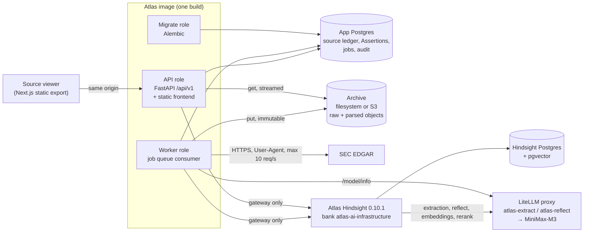
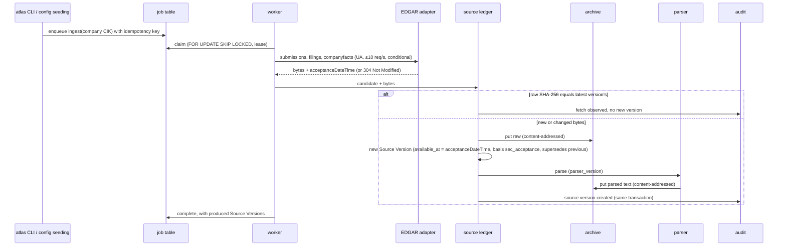
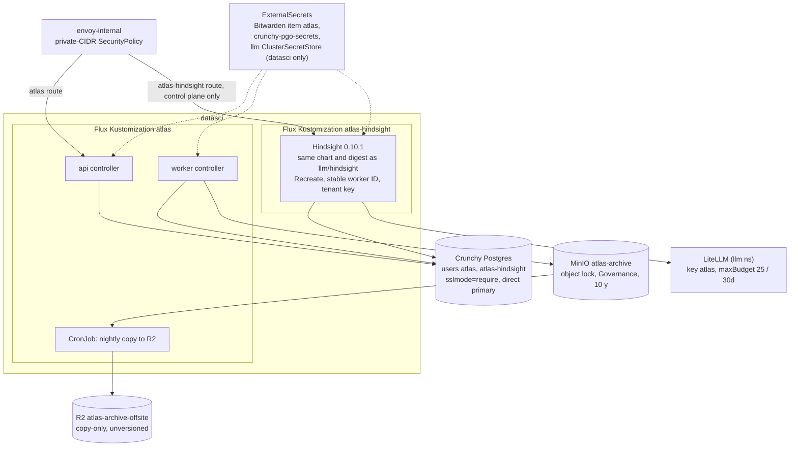

# Architecture

This document covers the components, boundaries, data flow and deployment of Atlas for Phases 0–2, which is the shape the pilot spec builds. Later phases are sketched only where they constrain today's boundaries.

Sources:

- the authoritative product spec [`hindsight_investment_research_build_plan.md`](../hindsight_investment_research_build_plan.md) v1.1, in particular §2 (Hindsight as the memory core), §4 (sources), §6 (Hindsight integration), §7.5 (prompt and tool security), §12 (codebase) and §13 and Appendix A (deployment)
- the pilot spec [`.scratch/atlas-pilot/spec.md`](../.scratch/atlas-pilot/spec.md): Part A (Phases 0–1) and Part B (Phase 2), sections "Modules", "Schema", "API" and "Deployment"
- [`decisions.md`](decisions.md), [ADR-0001](adr/0001-hindsight-document-id-per-source-version.md) (document IDs) and [ADR-0002](adr/0002-fresh-edgar-adapter-sibling-repos-reference-only.md) (reuse)
- [`hindsight-feature-matrix.md`](hindsight-feature-matrix.md), which overrides the product spec's description of Hindsight wherever they disagree

Companion documents: [`data-model.md`](data-model.md) (tables and ER diagram), [`threat-model.md`](threat-model.md), [`source-licenses.md`](source-licenses.md) (the entitlement inventory) and [`evaluation-methodology.md`](evaluation-methodology.md) (the gold-fixture format).

Terms follow [`CONTEXT.md`](../CONTEXT.md): Source Document, Source Version, Claim, Assertion, Evidence, Evidence Family, Memory, Bottleneck, Candidate, Hypothesis, Relationship, Research Snapshot, Replay Bank.

## 1. The core decision

**Hindsight is the memory and graph core. The Postgres source ledger and the immutable archive are the record of truth** (build plan §2). Hindsight extracts facts, links entities, consolidates observations and answers recall and reflect questions. Everything it produces is **Memory**: it can lead to Evidence but never is Evidence. Evidence is always an Assertion bound to a quote span in an archived Source Version.

Consequences that shape every component:

- No second automated memory graph (no Graphiti, Cognee, Neo4j, FalkorDB or Qdrant for Atlas). The typed Relationship table (Phase 3) is a reviewed projection of Assertions, not a second extraction system.
- A Source Version never bypasses the source ledger on its way to becoming an approved Relationship, financial fact or published Hypothesis.
- Every Hindsight citation is resolved back to the ledger before it counts (see §4.3).

## 2. Components

One Python 3.12 package (`backend/atlas/`) and one TypeScript frontend, shipped as **one container image** with three roles selected by command: `atlas api`, `atlas worker [--once]` and `atlas migrate` (spec Part A "Shape").

### 2.1 Runtime roles

| Role | Responsibility | Notes |
|---|---|---|
| **API** | `/api/v1` typed routes, `/health/live`, `/health/ready`, `/metrics`, and the static frontend on the same origin | Read routes plus Assertion create/review in Phase 1; recall, reflect enqueue, mental models, queue state and per-Source-Version memory in Phase 2. No public ingest endpoint. The OpenAPI schema is the contract; the frontend client is generated from it |
| **Worker** | Claims jobs from the Postgres job table and runs them: ingest (Phase 1), then retain, operation polling, reprocess, reflect and mental-model refresh (Phase 2) | Runs continuously, or a single pass (`--once`) for tests. No external orchestrator |
| **Migrate** | Applies Alembic migrations against the direct Postgres primary | Never through pgbouncer: migrations and the queue need session semantics |
| **Frontend** | The source viewer: a company's Source Documents, version history, the provenance panel, parsed text with selection-to-Assertion, raw download, the Assertion list with review actions | Next.js static export, TypeScript strict, served by FastAPI (one origin, one auth surface) |

### 2.2 Modules

Each is a deep module with a small interface (spec Part A and Part B, "Modules"). The package layout under `backend/atlas/` grows one module per ticket; build plan §12 gives the suggested names.

| Module | Owns | Interface (summary) | Phase / ticket |
|---|---|---|---|
| **Settings** | `ATLAS_*` env vars and versioned config files (`configs/`), validated at startup | Typed settings; optional providers log `<provider> disabled: missing <VAR>` once | 0 / 01 |
| **Audit** | The append-only, hash-chained `audit_event` table | `record(actor, action, entity, old_hash, new_hash)` in the caller's transaction; chain verification | 1 / 03 |
| **Actor** | The identity behind every mutation | From config in local and pilot deployments (`ATLAS_ACTOR`); every mutating service takes it explicitly so an authenticated principal can replace it later | 1 / 03 |
| **Jobs** | The Postgres job table as the queue | Deterministic job IDs from idempotency keys, leases, `FOR UPDATE SKIP LOCKED` claiming, bounded retries, recorded failures and artifacts. Phase 2 adds job kinds, a queue-level **pause** and a nightly window for backfill jobs | 1 / 04; 2 / 14 |
| **Archive** | Immutable, content-addressed raw and parsed objects | `put(bytes) -> uri` (idempotent by SHA-256, never overwrites), `get(uri) -> bytes`. Filesystem and S3 backends pass one contract suite. Callers only ever see internal application URIs | 1 / 05 |
| **Source adapters** | Fetching source material politely | The async `SourceAdapter` protocol (build plan §4.2): `discover`, `fetch`, `updates`. Phase 1: the SEC EDGAR adapter and a fixture adapter replaying recorded EDGAR responses | 1 / 06 |
| **Parser** | Deterministic HTML/text normalization | Explicit parser version; same input and version give identical output and content hash. Never calls an LLM | 1 / 07 |
| **Source ledger** (ingestion service) | The Source Document / Source Version lifecycle | Resolve a candidate to a Source Document (canonical URL or SEC accession), hash the bytes, record an unchanged fetch without a new version, or archive and create a new Source Version linked via `supersedes_version_id` and trigger parsing. Sets `available_at` and its basis. **The only writer of the archive and of Source Versions** | 1 / 07 |
| **Assertions** | Assertions and their review state | Create (rejects a quote that doesn't occur exactly at the anchor in the archived parse), review transitions per build plan §5.4, supersede by link (never edit). Researcher-created in Phase 1 | 1 / 08 |
| **Hindsight gateway** | All HTTP to Hindsight | Typed operations: batch retain, operation status, scoped recall, reflect with optional schema, memory lookup, bank template apply, mental-model create/refresh/history, per-bank LLM request log. Enforces the pinned-version rules (below) | 2 / 11 |
| **Bank template** | Bank missions, dispositions, directives and mental models | One versioned file in `configs/`, applied by dry run then import; version recorded per run | 2 / 12 |
| **LLM route recorder** | Which deployment backs each alias | Reads LiteLLM `/model/info` at the start of each run and stores the routed deployment per alias | 2 / 12 |
| **Retention service** | The bridge from the source ledger to Memory | Retain-or-link decision, sectioning, document IDs per ADR-0001, tags and metadata, zero-fact reprocess-then-flag | 2 / 13 |
| **Provenance resolver** | Citation states | Observation → `source_memory_ids` → world fact → `document_id` + `metadata.source_version_id` → Source Version and section; quote validation against the archived parse. Labels each citation **resolved**, **unverified** or **broken** | 2 / 15 |
| **Research query service** | Recall and reflect for the researcher | Recall is synchronous and scoped; reflect runs as a job whose answer, raw citations, resolved citations and structured-output errors are stored | 2 / 15 |

**Gateway rules for Hindsight 0.10.1** (feature matrix; `decisions.md`, 2026-09-28):

- Only strict tag modes (`any_strict`, `all_strict`). `any` is rejected before any call, because it includes untagged memories.
- No union types in response schemas (0.10.1 returns HTTP 500); use `*_known` booleans.
- Operation outcomes are decided only by the operation's `status`, with polling timeouts. HTTP 200 on reflect doesn't mean the structured output succeeded; `structured_output_error` is checked.
- Observations are listed via `memories/list?type=observation` and knowledge pages via `knowledge-base/tree` (the documented routes return 405).
- `query_timestamp` and `temporal_window` are ranking hints, never an as-of boundary.

## 3. Boundaries

### 3.1 Write boundaries

| Data | Sole writer | Everyone else |
|---|---|---|
| Archive objects (raw and parsed) | Source ledger (ingestion service) in the worker | Read through the API, which streams content; nobody holds object-store credentials except the app's scoped `atlas` user |
| `source_document`, `source_version` | Source ledger | Read-only. Content columns are immutable, enforced in the database |
| `assertion` | Assertions module, acting for the configured actor | Agents (Phase 4) may propose Claims; only the review path promotes them |
| `audit_event` | Audit module, inside each mutating transaction | Nobody can UPDATE or DELETE; enforced by trigger and role privileges |
| `job` | Jobs module | Workers claim via `SKIP LOCKED` |
| Hindsight banks | Hindsight gateway (retain, template import, mental models) | No code reads or writes Hindsight's tables directly |
| Bank configuration | The versioned template via the gateway | Never edited by hand in Hindsight's UI for the research bank |

Build plan §7.5 wants separate DB roles for these boundaries "where practical". The pilot enforces the audit boundary in the database (ticket 03) and the archive boundary through object lock and the scoped user (ticket 19). The remaining boundaries are code paths for now; see the threat model's residual risks.

### 3.2 Trust boundaries

- **Source text is untrusted data.** Anything fetched (filings, IR pages, search results) can contain instructions. They never change prompts, tools, policies or state. See the threat model.
- **Memory is derived and untrusted until resolved.** Hindsight output is a lead to Evidence, not Evidence. One observation never counts as an independent witness, and neither does a repeated summary of the same Source Version.
- **Third-party agent skills are data, never instructions** (map ticket 12). They apply to development tooling, not the runtime, but the rule is the same.
- **Network:** unit tests have no network (pytest-socket); integration tests reach localhost only; CI makes no LLM calls and replays the Hindsight recordings. In the cluster, the Hindsight API has no route, and Atlas is reachable only on the internal gateway behind a private-CIDR SecurityPolicy.

### 3.3 Isolation from other systems

- A dedicated Atlas Hindsight release, not the shared `llm/hindsight`: that release has one tenant key for all banks, auto-merged upgrades and a drifting model list (build plan §6.1).
- Hindsight's database is separate from the application database (separate database and role).
- Sibling repositories (`trading-research`, `alphaos`, `TradingDashboard`) are reference only: no code, data, services or buckets are shared (ADR-0002).

## 4. Data flow

### 4.1 Phase 1: SEC ingest to Assertion

The researcher then opens the Source Version in the viewer, checks the provenance panel against the raw download, selects a passage and creates an Assertion. The Assertions module rejects it unless the quote occurs exactly at the anchor in the archived parse. Review decisions (`corroborated`, `disputed`, `rejected`, `superseded`) each write an audit event.

### 4.2 Phase 2: retain into Memory

1. A new Source Version (parsed) enqueues a retain job.
2. The retention service checks whether a Source Version with the same raw hash is already retained. If so, it records a `linked` mapping and stops (ADR-0001).
3. Otherwise it splits the parse into sections with anchors and character offsets, and submits **one batch per Source Version** through the gateway. Document IDs are `srcv:<source_version_uuid>:<section-anchor>` and never reused. Tags: `company:<uuid>`, `theme:<slug>`, `source:<provider>`, `doctype:<kind>`, `form:<form>`. Metadata carries `source_version_id`, the anchor, the offsets and `available_at`.
4. A polling job follows the Hindsight operation to a terminal `status`. On completion, memories are counted per document. A zero-fact section is reprocessed once, then flagged `zero_fact`.
5. A 429 or outage-classified failure pauses the ingest queue with backoff capped at 1 h, instead of failing jobs or switching models. Backfill-class jobs run only in the nightly window.

### 4.3 Phase 2: recall and reflect to Evidence

1. The researcher asks through `POST /api/v1/memory/recall` (synchronous) or `POST /api/v1/memory/reflect` (enqueued as a job), scoped by company and theme with strict tags.
2. The provenance resolver follows each cited memory to a Source Version and section: observation → `source_memory_ids` → world fact → `document_id` + `metadata.source_version_id`.
3. Each quote is validated against the archived parse (normalizing only whitespace and typographic quotes).
4. Each citation is labeled **resolved**, **unverified** (chunk-only content or a quote mismatch) or **broken** (the memory is gone). Only resolved citations are shown as Evidence.
5. The stored answer records its run, which records the code version, Hindsight version, template version and the routed deployment per alias.

Mental models (Theme status and Bottlenecks) are defined in the bank template, refreshed by a daily scheduled job with a minimum interval (never after consolidation), and resolved like any reflect answer.

### 4.4 Clocks

Kept distinct everywhere (build plan §4.3, §9.1; spec story 30):

| Clock | Meaning | Source |
|---|---|---|
| `event_at` | When the underlying development happened | From the document, when known |
| `published_at` | The publisher's release time | Publisher metadata |
| `available_at` + `available_at_basis` | Earliest time the material was publicly obtainable | SEC: `acceptanceDateTime`, basis `sec_acceptance`. Otherwise a reliable publisher timestamp (`publisher_timestamp`) or, conservatively, the observed discovery time (`observed_discovery`) |
| `first_seen_at` | When Atlas first saw the Source Document | Ledger |
| `fetched_at` | When this copy was fetched | Ledger |
| `ingested_at` / `analyzed_at` | When Atlas processed it | Ledger, runs |

`available_at <= as_of` is the mandatory gate for any historical view. Hindsight's temporal hints are not a boundary.

## 5. Deployment

### 5.1 Local Compose (dev and CI)

`compose.yaml` defines:

| Service | Purpose |
|---|---|
| `postgres-app` | Postgres 17, the application database |
| `silo` | PGSTY Silo (a maintained MinIO fork, pinned by digest) as the S3-compatible server for the archive contract suite; MinIO no longer publishes images. The dev default archive backend is the filesystem |
| `migrate`, `api`, `worker` | The app image in its three roles, read-only root filesystem with a `/tmp` tmpfs |

Ticket 12 adds the pinned Hindsight 0.10.1 and its pgvector database, configured like the spike (`spikes/hindsight/`): LiteLLM as the `openai` provider, thinking disabled via extra body, 2 concurrent LLM calls, 4 worker slots, `qwen3-embedding-0.6b` embeddings (1024 dims), LiteLLM `rerank`, 300 s timeouts.

Readiness (`/health/ready`) is the truth about whether the flow works, not Compose ordering. It checks the database and the archive in Phase 1, and adds Hindsight and LiteLLM in Phase 2. Until then those report `not_configured`.

**CI:** `scripts/ci.sh` is the one entrypoint, and GitHub Actions runs exactly it. It runs ruff format and lint, strict pyright, the frontend gates (including a check that the generated API client matches the OpenAPI schema), pytest (unit with network blocked, integration against the Compose Postgres and Silo), the Playwright smoke test of the source viewer against a fixture-seeded API, and the image build with a non-root, read-only smoke test. It is fixture-only: no paid keys, no LLM calls, Hindsight replayed from the 58 recordings.

### 5.2 Home cluster (from Phase 2)

Placement: namespace `datasci` in `home-ops`, under `kubernetes/apps/datasci/atlas/` (spec Part B "Deployment"; `decisions.md` "deploy shape"; build plan Appendix A; `docs/research/home-ops-wiring.md` on the `research/home-ops-wiring` branch).

- **Workloads:** app-template 5.2.1 with `api` and `worker` controllers plus the nightly R2 copy CronJob. It depends on `atlas-hindsight`, crunchy and external-secrets. Requests and limits: api 100m / 256Mi (limit 1Gi), worker 100m / 512Mi (limit 2Gi), Hindsight 250m / 1Gi (limit 4Gi). Topology spread `ScheduleAnyway`.
- **Hindsight:** a dedicated release with no API route, only the control plane on an internal route, and no TEI sidecar (reranking goes through LiteLLM). `CREATE EXTENSION vector` is run once by the owner (runbook).
- **Archive:** `atlas-archive` is created by a re-runnable provisioning script (ticket 19), not OpenTofu: object lock in Governance mode with 10-year default retention, and a scoped `atlas` user without bypass rights. A nightly copy-only CronJob replicates it to R2; immutability holds on MinIO only.
- **Secrets:** Bitwarden item `atlas` (`SEC_USER_AGENT`, `HINDSIGHT_API_KEY`, `S3_*`, `R2_*`), DB credentials via `crunchy-pgo-secrets`, the LiteLLM key via a new `llm` ClusterSecretStore restricted to `datasci`. One ExternalSecret per target Secret.
- **Releases:** the app repo (`github.com/ekenheim/atlas`) builds and pushes a public GHCR image on each release tag. Home-ops pins a released version. Renovate opens bump PRs with automerge off for Atlas and for the dedicated Hindsight (by path, not package name), so the owner's merge is the deploy. Home-ops changes are prepared and validated locally (flux-local, kubeconform, yamllint) and opened by the owner.
- **Observability:** a ServiceMonitor for `/metrics`, a PrometheusRule for repeated operation failures, zero-fact spikes and long queue pauses, and an in-cluster Gatus HTTP check (the `guarded` template only checks public DNS).
- **Rollout order:** Crunchy users and `vector`; LiteLLM aliases, key and store; Renovate rules; `atlas-hindsight`; archive provisioning and R2 (outside Git); the `atlas` app. After each deploy the owner runs the smoke script (ready, one small ingest, one resolved recall).

## 6. Later phases (constraints only)

- **Phase 3:** Company IR, SearXNG and optional Exa adapters behind the same protocol and the entitlement gate in [`source-licenses.md`](source-licenses.md); near-duplicate detection and Evidence Families; entity resolution; the reviewed Relationship projection from a fixed predicate whitelist.
- **Phase 4:** typed agent roles (Theme Scout, Supply-chain Investigator, Skeptical Reviewer, Financial Analyst, …) as jobs with budgets; they read Hindsight and the ledger and propose Claims, and never write the archive or promote Assertions (build plan §7).
- **Phase 5:** XBRL normalization with as-of selection by filing availability; deterministic scenarios.
- **Phase 6a:** Research Snapshots (immutable, also written to the archive under `snapshots/`) and a Replay Bank leakage test.

## 7. Decisions index

| Topic | Where |
|---|---|
| Deviations from the product spec (auth, LiteLLM, CI gate, embeddings, release-driven deploy, archive provisioning, deploy shape) | [`decisions.md`](decisions.md) |
| Hindsight document IDs per Source Version and section | [ADR-0001](adr/0001-hindsight-document-id-per-source-version.md) |
| Fresh EDGAR adapter; sibling repos reference only | [ADR-0002](adr/0002-fresh-edgar-adapter-sibling-repos-reference-only.md) |
| Verified Hindsight 0.10.1 behavior | [`hindsight-feature-matrix.md`](hindsight-feature-matrix.md) |
| Extraction model choice | [`research/extraction-bakeoff.md`](research/extraction-bakeoff.md) |
