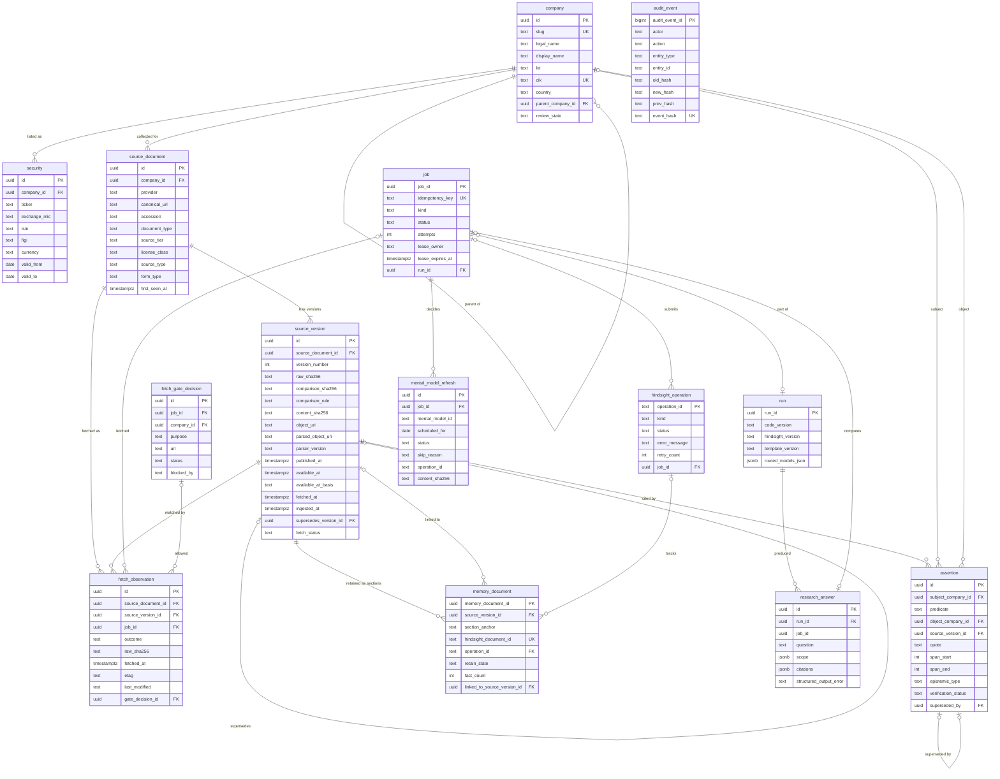

# Data model (Phases 1–2)

The application database schema that the Phase 1 and Phase 2 migrations build, with the invariants the database itself must enforce.

Sources:

- the pilot spec [`.scratch/atlas-pilot/spec.md`](../.scratch/atlas-pilot/spec.md): Part A "Schema (Phase 1 migrations)" and Part B "Schema (Phase 2 migrations)"
- the product spec [`hindsight_investment_research_build_plan.md`](../hindsight_investment_research_build_plan.md) §5.1 (company), §5.3 (source_document / source_version), §5.4 (assertion), §5.8 (job, audit_event), §6.3 (retention mapping) and §9.1 (clocks)
- [ADR-0001](adr/0001-hindsight-document-id-per-source-version.md) (Hindsight document IDs) and [`decisions.md`](decisions.md) (citation states, zero-fact handling, routed-model recording)

Terms follow [`CONTEXT.md`](../CONTEXT.md). The architecture is in [`architecture.md`](architecture.md).

**Status of this document.** It is the contract that tickets 03, 04, 07, 08, 12, 13, 14 and 15 implement. Column names may be refined in those tickets where repository conventions are stronger (build plan §5 allows this). A ticket that changes a name, type or constraint updates this document in the same change. Items marked **(open)** are left to the named ticket.

## 1. Conventions

- **Keys:** UUID primary keys, generated by the application. The column is named `id` (the convention tickets 03, 04 and 07 set); foreign keys are `<table>_id`. Job IDs are deterministic (UUIDv5 of the idempotency key). `audit_event` uses a monotonic `bigint` sequence, because the hash chain needs a total order.
- **Timestamps:** `timestamptz`, stored in UTC. Clock columns are never reused for another meaning (§4 below).
- **Hashes:** lowercase hex SHA-256 as `text` with a `CHECK` on the pattern `^[0-9a-f]{64}$`.
- **Enumerations:** `text` with `CHECK` constraints (easier to extend in a backwards-compatible migration than Postgres enums).
- **JSON:** `jsonb`, only for open-ended metadata and payloads, never for fields the application filters on.
- **Archive locations:** internal application URIs (`archive://<raw|parsed>/sha256/<hex>`, ticket 05), never object-store URLs or credentials.
- **Migrations:** Alembic, backwards-compatible, and tested by upgrading from empty (build plan §12).
- **Every mutation** writes an `audit_event` in the same transaction (§2.6).

Company universe and theme membership are **configuration** (`configs/`), not tables, in Phases 1–2 (spec Part A "Shape"); from Phase 3 a committed Candidate adds a company in the database (`universe_company`, §3.1g). `company` rows are seeded from `configs/themes/ai-infrastructure.yaml`, keyed by slug, with IDs derived from the CIK. Themes appear only as slugs, in tags (`theme:photonics`) and in scopes.

## 2. Phase 1 tables

### 2.1 `company`

A legal entity, not a ticker (build plan §5.1). Built by ticket 07 (migration `0004`).

| Column | Type | Notes |
|---|---|---|
| `id` | uuid PK | The canonical company ID; also the Hindsight tag `company:<uuid>`. Deterministic: UUIDv5 of the CIK (or of the slug when there is no CIK), so every database seeded from the same config agrees |
| `slug` | text not null, unique | The config key (`lumentum`), used by `atlas ingest --company` |
| `legal_name` | text not null | |
| `display_name` | text not null | |
| `lei` | text null | External mapping; not available for every company |
| `cik` | text null, unique | Zero-padded 10 digits. The 12 photonics companies are seeded from config (Phase 3); the three exchange-disclosed ones have none |
| `country` | text null | ISO 3166-1 alpha-2. Not null for a `researched` company; a counterparty no registry placed has none (migration `0045`) |
| `website` | text null | |
| `layer` | text null | Primary photonics supply-chain layer: `substrate`, `epi`, `chip-laser`, `dsp`, `module`, `contract-manufacturing`, `system` (migration `0015`) |
| `source_path` | text null | `sec`, or `exchange:<hkex\|fca-nsm\|amf>` (`lse-rns` until 0025, `euronext` until 0029). Only `sec` companies are fetched by the SEC ingest; `sec` requires a `cik`. Unsponsored-ADR CIKs (Soitec, IQE, Innolight) are listed as `ignored_ciks` in config, never stored as a company's `cik` |
| `sec_forms` | text[] null | SEC forms to ingest (e.g. `20-F`, `6-K` for STMicroelectronics); NULL means 10-K/10-Q/8-K. Only for `sec` companies |
| (config only) `exchange` | | For an `exchange:*` company: `issuer_code` (e.g. HKEX stock code `03308`) and `feed_id` (the feed's own ID, e.g. HKEXnews `stockId`). Read by the exchange ingest; not a column |
| `parent_company_id` | uuid null FK → company | Parent/subsidiary structure |
| `review_state` | text not null | `unreviewed`, `reviewed` |
| `role` | text not null, default `researched` | `researched` (a universe company) or `counterparty` (known only as the other end of Relationships: no `source_path`, never ingested, never an investigation seed, in no theme). Migration `0045`; `docs/decisions.md`, "Counterparty companies" |
| `counterparty_resolution` | jsonb null | How a counterparty was identified: `named_as` (the name as quoted), `source` (`sec`/`gleif`), `source_url`, `observed_at` and the whole `resolution`. Required for a counterparty; kept when it is promoted |
| `created_at`, `updated_at` | timestamptz not null | |

Seeding (`atlas companies seed`, and every ingest job for its company) upserts by ID. An unchanged row is left alone and writes no audit event; a changed one writes `company.updated` with the old and new content hashes. Seeding sets `role` to `researched`, so a counterparty the config names (same CIK, or same slug without one) is promoted in place. A counterparty is created by claim extraction (`company.counterparty_created`, actor `atlas-investigator`) and promoted by a Candidate's commit too (`company.promoted`).

### 2.2 `security`

Effective-dated listing identifiers, so ticker changes, ADRs and multiple listing lines don't change a company's identity.

| Column | Type | Notes |
|---|---|---|
| `id` | uuid PK | UUIDv5 of (company, exchange, ticker, `valid_from`) |
| `company_id` | uuid not null FK → company | |
| `ticker` | text not null | |
| `exchange_mic` | text not null | ISO 10383 **operating** MIC (`XNAS`, `XNYS`) |
| `segment_mic` | text null | The segment MIC OpenFIGI matched (`XNGS` for Nasdaq Global Select); migration `0020` |
| `isin` | text null | External mapping |
| `figi` | text null | The **composite** (country-level) FIGI: it matches `exchange_mic` granularity for US listings and survives a ticker change. Venue FIGIs are not stored |
| `share_class_figi` | text null | Connects one class's listings across countries (`0020`) |
| `underlying_security_id`, `adr_ratio` | uuid null FK → security, numeric null | An ADR's underlying line and ratio; no source gives the ratio, so both are the owner's (`0020`) |
| `review_state` | text not null | `unreviewed`, `needs_review`, `reviewed` (`0020`) |
| `instrument_type` | text not null | `common`, `adr`, `preferred`, … |
| `currency` | text not null | ISO 4217; from the venue for resolved listings (OpenFIGI returns none) |
| `valid_from` | date not null | For a listing entity resolution found and no config names: the day Atlas observed it (no source gives a start date) |
| `valid_to` | date null | Null means current |

Constraint: no overlapping `[valid_from, valid_to)` for the same (`exchange_mic`, `ticker`), via an exclusion constraint (`btree_gist`): the uniqueness per (MIC, ticker, validity). Seeding never deletes a row; an ended listing gets a `valid_to` in config. Seeding sets `isin`/`figi` (and `company.cik`/`lei`) only when config names them, so it never erases what entity resolution set.

### 2.2a `company_alias` and `identity_mapping` (Phases 3–6a, migration `0020`)

Entity resolution (`atlas.identity`, `docs/decisions.md` "Entity resolution").

`company_alias` (insert-only): a company's legal, former and other names.

| Column | Type | Notes |
|---|---|---|
| `id` | uuid PK | UUIDv5 of (company, source, kind, name, `valid_from`) |
| `company_id` | uuid not null FK → company | |
| `name`, `normalized_name` | text not null | `normalized_name` is `normalize_name(name)`, what lookups compare |
| `kind` | text not null | `legal`, `former`, `other` (GLEIF other and transliterated names) |
| `valid_from`, `valid_to` | date null | SEC `formerNames` intervals; null is open |
| `source`, `source_url`, `observed_at` | text, text, timestamptz not null | `sec` or `gleif`, the response it came from, and when |

Unique (NULLS NOT DISTINCT) per (company, source, kind, name, `valid_from`).

`identity_mapping`: each identifier the resolver proposed for a company.

| Column | Type | Notes |
|---|---|---|
| `id` | uuid PK | UUIDv5 of (company, kind, value); unique (company, kind, value) |
| `company_id` | uuid not null FK → company | |
| `security_id` | uuid null FK → security | The listing it set, once applied |
| `kind`, `value` | text not null | `cik`, `lei`, or `listing` (`TICKER@MIC`) |
| `tier` | text not null | `exact`, `corroborated`, `candidate` (a conflict proposes nothing) |
| `review_state` | text not null | `committed` (applied automatically), `pending` (the owner's queue), `confirmed`, `rejected` |
| `owner_confirmation` | boolean not null | Only the owner commits it (every CIK↔LEI link, every candidate). CHECK: never `committed` |
| `source`, `source_url`, `observed_at` | text, text, timestamptz not null | `sec`, `gleif` or `openfigi`; provenance |
| `reasons` | text[] not null | Why it needs review |
| `details` | jsonb not null | The LEI record's names, jurisdiction and status; a listing's fields |
| `evidence` | jsonb not null | The resolution's facts: `{source, url, observed_at, statement}` |
| `reviewed_by`, `reviewed_at`, `review_note` | null | Set together on confirm/reject; a rejection needs its reason |
| `created_at` | timestamptz not null | |

### 2.3 `source_document`

The stable identity of a piece of source material, independent of any copy (build plan §5.3; spec story 25). Immutable: a trigger rejects every `UPDATE`, `DELETE` and `TRUNCATE`.

| Column | Type | Notes |
|---|---|---|
| `id` | uuid PK | |
| `company_id` | uuid null FK → company | The company the document is about or was collected for. Many-to-many subjects arrive with entity resolution in Phase 3 |
| `provider` | text not null | Adapter ID, for example `sec_edgar`; also the tag `source:<provider>` |
| `canonical_url` | text not null | Scheme and host lowercased, query and fragment removed; unique together with `provider` |
| `origin_url` | text not null | As first discovered |
| `accession` | text null, indexed | SEC accession number (`0000000000-00-000000`) when the document belongs to a filing. **Not unique:** one filing holds several documents (the primary document and its EX-99 exhibits) |
| `form_type` | text null | SEC form of the filing (`10-K`, `10-Q`, `8-K`, …); also the tag `form:<form>` |
| `document_type` | text null | The document within the filing (`8-K`, `EX-99.1`) |
| `source_type` | text not null | Document kind: `filing`, `xbrl_companyfacts` (later `ir_release`, …); also the tag `doctype:<kind>` |
| `title` | text not null | As first discovered; for display only, never for identity |
| `publisher` | text not null | `SEC EDGAR` for SEC material |
| `source_tier` | text not null | `A`, `B`, `C` (build plan §4.1) |
| `license_class` | text not null | From the entitlement inventory ([`source-licenses.md`](source-licenses.md) §2), checked against the list of classes |
| `first_seen_at` | timestamptz not null | When Atlas first saw it (the adapter's discovery time) |

Identity rule: a Source Document is found by (`provider`, `canonical_url`). For SEC filings the canonical URL is the accession's Archives folder plus the file name, so it is equivalent to (accession, document). Titles are never used, so two quarterly filings with similar titles are never merged.

### 2.4 `source_version`

One immutable, hash-identified copy of a Source Document (build plan §5.3, §4.3; spec stories 26–33).

| Column | Type | Notes |
|---|---|---|
| `id` | uuid PK | Also the stem of the Hindsight document ID (ADR-0001) |
| `source_document_id` | uuid not null FK → source_document | |
| `version_number` | integer not null | 1, 2, … per document; unique per document |
| `raw_sha256` | text not null | Hash of the exact fetched bytes |
| `comparison_sha256` | text not null | Change-detection hash: SHA-256 of the raw bytes after `comparison_rule` removed bytes that are not content |
| `comparison_rule` | text not null | `sec-edge-script-v1` (SEC Archives HTML: every `<script>` element removed) or `identity` (the raw bytes) |
| `object_uri` | text not null | Internal URI of the raw object (`archive://raw/sha256/<hex>`) |
| `byte_size` | bigint not null | Length of the raw bytes |
| `media_type` | text not null | As served, for the raw download |
| `content_sha256` | text null | Hash of the parsed text; null when not parsed |
| `parsed_object_uri` | text null | Internal URI of the parsed object (`archive://parsed/sha256/<hex>`) |
| `parser_version` | text null | Set with the parse (`html-text-v1`; `text-v2` from migration `0014`: the same HTML/text rules plus PDF and the language) |
| `parse_status` | text not null | `pending`, `parsed`, `incomplete` (undecodable bytes were replaced), `failed`, `unsupported` (0014: a parsed format with no usable text, e.g. an image-only or scanned PDF; Atlas does no OCR), or `not_applicable` (media types the parser doesn't handle, e.g. companyfacts JSON) (spec story 22) |
| `parse_error` | text null | Set iff `parse_status` is `failed` or `unsupported` (why) |
| `language` | text null | 0014. ISO 639 primary subtag (`en`, `fr`, `zh`, ...) or `und` (undetermined): the adapter's declaration (EDGAR: `en`), else the parse's (a declared `<html lang>` or PDF `/Lang`, else a deterministic guess). Null when neither says (an unparsed format without a declaration). Only `en` versions are retained (and, later, extracted); versions before 0014 are all EDGAR, so `en` |
| `page_anchors` | jsonb null | 0014. A PDF parse's pages: `[{page, label, start, end}]`, `label` from the PDF's `/PageLabels` (else the number), `[start, end)` code-point offsets into the parsed text. Null for formats without pages; set only with a `parsed` or `incomplete` parse |
| `event_at` | timestamptz null | When the underlying development happened, if known (null for SEC filings in Phase 1) |
| `published_at` | timestamptz null | The publisher's release time, when it gives one distinct from availability. Null for SEC: EDGAR's release time is the acceptance time, recorded as `available_at`, and the filing date is in `metadata` |
| `available_at` | timestamptz **not null** | Earliest public availability |
| `available_at_basis` | text **not null** | `sec_acceptance`, `sec_dissemination` (0012), `publisher_timestamp`, `observed_discovery`, `observed_revision` (0011) |
| `fetched_at` | timestamptz not null | When these bytes were fetched |
| `ingested_at` | timestamptz not null | When the ledger committed the row (build plan §9.1 strict-replay clock) |
| `supersedes_version_id` | uuid null, unique, FK → source_version | The version this one replaces: the previous version of the same Source Document |
| `fetch_status` | text not null | `ok`, `partial` (bytes truncated or incomplete) |
| `metadata` | jsonb not null default `{}` | Adapter metadata. For SEC: `acceptance_datetime` as received, `accession_number`, `form`, `filing_date`, `report_date`, `primary_document` and `items`. For every fetch: its `url`, the `http` validators and the number of `attempts` |

Invariants enforced in the database:

- `UNIQUE (source_document_id, raw_sha256)`: the same bytes are never two versions of a document.
- `available_at` and `available_at_basis` are `NOT NULL`, and the basis is checked against the enumeration. SEC filing documents use `sec_acceptance`, or `sec_dissemination` when EDGAR held the filing to the next business day (migration `0012`; readers take availability from the `source_version_availability` view, which applies any recorded `source_version_availability_correction`); companyfacts has no acceptance time and uses `observed_discovery`. A version that supersedes an earlier one uses its fetch time, basis `observed_revision` (migration `0011`; `docs/decisions.md`).
- A trigger rejects any `UPDATE` of the content columns (everything except the parse columns) and any `DELETE` or `TRUNCATE`. The parse columns (`content_sha256`, `parsed_object_uri`, `parser_version`, `parse_status`, `parse_error`, `language`, `page_anchors`) may be written again only while `parse_status` is `pending` or `failed`; a recorded parse is never overwritten.
- `supersedes_version_id` is the previous version (`version_number - 1`) of the same Source Document (trigger). It is unique, so the chain never forks, and it is null exactly for version 1.
- The parse columns are consistent: `content_sha256` and `parsed_object_uri` are set iff the status is `parsed` or `incomplete`.

The ledger parses in the same transaction that creates the version, so Phase 1 never leaves a version `pending`. A re-parse under a new parser version must not overwrite the recorded parse. It will be a separate parse record (a `source_parse` table keyed by version and parser version), built when a re-parse is first needed. `text-v2` doesn't need one: its HTML and text output is `html-text-v1`'s, so versions parsed under v1 keep that record (`docs/decisions.md`, "PDF parsing and language").

### 2.4a `fetch_observation`

One row per fetch of a Source Document that returned or confirmed content, including fetches that created nothing new (ticket 07). Append-only: a trigger rejects every `UPDATE`, `DELETE` and `TRUNCATE`.

| Column | Type | Notes |
|---|---|---|
| `id` | uuid PK | |
| `source_document_id` | uuid not null FK → source_document | |
| `source_version_id` | uuid not null FK → source_version | The version these bytes are or match; for a 304, the latest version |
| `job_id` | uuid null FK → job | The ingest job that fetched it |
| `outcome` | text not null | `new_version`, `unchanged` (same raw hash or same comparison hash), `not_modified` (HTTP 304) |
| `url` | text not null | The final URL, after redirects |
| `fetched_at` | timestamptz not null | |
| `observed_at` | timestamptz not null | When the ledger recorded it |
| `raw_sha256`, `comparison_sha256` | text null | The hashes of this fetch's bytes; null exactly for a 304 |
| `object_uri` | text null | Set when this fetch's exact bytes differ from the matched version's (only non-content bytes changed), so they stay archived |
| `etag`, `last_modified` | text null | The HTTP validators. The latest observation's are sent on the next fetch (a conditional request) |
| `attempts` | integer not null | HTTP attempts it took |
| `gate_decision_id` | uuid null FK → fetch_gate_decision | The `allowed` fetch gate decision the fetch was made under (exchange sources; migration `0023`). NULL for SEC EDGAR. A trigger refuses one that names a `blocked` decision |

So an **unchanged re-fetch** (same raw hash, same comparison hash, or HTTP 304) creates no Source Version. It creates an observation, an audit event (`fetch.unchanged` or `fetch.not_modified`) and a job artifact. Fetch errors and permission denials that produce no bytes are recorded as job failures that list each failed URL (spec story 22).

### 2.4c `fetch_gate_decision` (migration `0023`)

One row per URL an exchange ingest asked the fetch gate about (`atlas.sources.gate`), before any request to it: the feed's search (`purpose = discovery`) and each document (`document`). Append-only, like the ledger. A `blocked` decision has no fetch observation, since nothing was requested; it is how a source that forbids automation stays visible (`GET /api/v1/companies/{id}/fetch-gate-decisions?status=blocked`, `GET /api/v1/fetch-gate-decisions/{id}`).

| Column | Type | Notes |
|---|---|---|
| `id` | uuid PK | |
| `job_id` | uuid null FK → job | The ingest job |
| `company_id` | uuid null FK → company | |
| `provider` | text not null | The adapter, e.g. `hkexnews` |
| `purpose` | text not null | `discovery` or `document` |
| `url` | text not null | The URL asked about |
| `status` | text not null | `allowed` or `blocked` |
| `blocked_by` | text null | `register` (host not onboarded), `terms` (terms forbid automation without consent, or not checked) or `robots`; set iff `blocked` |
| `reason` | text not null | Why, in words (e.g. the deciding robots.txt rule and its line) |
| `site` | text null | The site register's name for the site |
| `terms` | jsonb null | The register's terms record relied on: `url`, `checked_on`, `automation`, `note`, `consent` |
| `robots` | jsonb null | The robots.txt relied on: `url`, `status`, `sha256`, `object_uri` (archived body), `fetched_at`, `group`, `rule`. Null when blocked before robots.txt was read |
| `user_agent_token` | text not null | The product token matched against robots.txt groups (`AtlasResearch`) |
| `decided_at` | timestamptz not null | |
| `recorded_at` | timestamptz not null | |

An `allowed` decision has `site`, `terms` and `robots` (a CHECK).

### 2.4b `evidence_family` and `evidence_family_member` (migration `0016`)

Copies of one announcement (syndication, a re-filed exhibit) are one Evidence Family, one witness. Rules in `atlas.ledger.families` and `docs/decisions.md`. Both tables are append-only (ENABLE ALWAYS triggers reject `UPDATE`, `DELETE`, `TRUNCATE`).

| `evidence_family` | Type | Notes |
|---|---|---|
| `id` | uuid PK | |
| `simhash_rule` | text not null | `simhash64-w3-blake2b-v1` |
| `max_hamming_distance` | integer not null | The threshold the family was founded with (default 3); later copies join within it |
| `created_at` | timestamptz not null | |

| `evidence_family_member` | Type | Notes |
|---|---|---|
| `source_version_id` | uuid PK FK → source_version | A parsed version is in exactly one family |
| `evidence_family_id` | uuid not null FK → evidence_family | |
| `seq` | bigint identity unique | Assignment order (the founder first; ties break by it) |
| `content_sha256` | text not null | The parse hash (exact duplicates) |
| `simhash` | bigint not null | The 64-bit SimHash of the parse, as a signed bigint |
| `match` | text not null | `founder`, `content_hash` or `simhash` |
| `matched_source_version_id` | uuid null FK → evidence_family_member | The member it duplicates; null exactly for a founder |
| `hamming_distance` | integer null | To that member; null exactly for a founder |
| `assigned_at` | timestamptz not null | |

The ledger assigns a family in the transaction that creates a parsed version; `atlas ledger assign-families` backfills versions recorded before `0016`. Unparsed versions (`not_applicable`, `failed`) have no family.

### 2.5 `assertion`

A statement bound to one Source Version and an exact quote span (build plan §5.4; spec stories 37–42).

| Column | Type | Notes |
|---|---|---|
| `id` | uuid PK | The spec's `assertion_id` (primary keys are named `id`) |
| `subject_company_id` | uuid not null FK → company | The spec's `subject_entity_id`. Only companies are entities in Phases 1–2; products, technologies and themes arrive in Phase 3 |
| `predicate` | text not null | Free text in Phase 1; the Relationship predicate whitelist applies to Relationships (Phase 3), not to Assertions |
| `object_company_id` | uuid null FK → company | The spec's `object_entity_id` |
| `value_json` | jsonb null | A value instead of, or as well as, an object |
| `source_version_id` | uuid not null FK → source_version | Must have parsed text (`parse_status` `parsed` or `incomplete`; insert trigger) |
| `quote` | text not null | The spec's `quote_or_span`. Must occur exactly at the span in the archived parse |
| `span_start`, `span_end` | integer not null | Character (Unicode code point) offsets into the parsed text, `[span_start, span_end)`; `quote = parsed_text[span_start:span_end]` is validated on create, and `span_end - span_start = char_length(quote)` is a CHECK |
| `page_or_anchor` | text null | A label for people; the offsets are the binding. Omitted on a PDF version (with `page_anchors`), it is set to the span's page label, e.g. `page 1 (PDF page 2)` |
| `event_start`, `event_end` | timestamptz null | When the asserted state held |
| `epistemic_type` | text not null | `direct_source_statement`, `company_claim`, `third_party_report`, `agent_inference`, `quantitative_derived` |
| `verification_status` | text not null default `unreviewed` | `unreviewed`, `corroborated`, `disputed`, `rejected`, `superseded`. The API calls this `review_state` |
| `independence_family_id` | uuid null | Evidence Family; null until Phase 3 |
| `extracted_at` | timestamptz not null | |
| `extractor_version` | text not null | `manual` for researcher-created Assertions; `investigator.v<N>` (the prompt version) for ones the Investigator's Claims became (ticket 10), created by `atlas-investigator` with `value_json` `{claim_id, layer, product, object_text}` |
| `created_by` | text not null | Actor |
| `reviewer_id` | text null | Actor of the latest review; set exactly when reviewed |
| `reviewed_at` | timestamptz null | Set exactly when reviewed |
| `superseded_by` | uuid null FK → assertion | Set exactly when `verification_status = superseded`; never the row itself |

Invariants (migration `0006`, triggers ENABLE ALWAYS):

- Every column except the review columns (`verification_status`, `reviewer_id`, `reviewed_at`, `superseded_by`) is immutable after insert. A correction is a new Assertion plus supersession, never an edit.
- New rows are `unreviewed`.
- Review transitions: `unreviewed`, `corroborated` and `disputed` may move to any other state except `unreviewed`; `rejected` and `superseded` are final.
- A successor must not itself be `rejected` or `superseded`, so supersession never forms a cycle.
- No DELETE or TRUNCATE.
- Each create writes an `assertion.created` audit event, and each review an `assertion.reviewed` event, in the same transaction.

### 2.6 `audit_event`

Append-only and hash-chained (build plan §5.8; spec stories 43–45; ticket 03).

| Column | Type | Notes |
|---|---|---|
| `audit_event_id` | bigint PK (identity) | Total order of the chain |
| `occurred_at` | timestamptz not null | |
| `actor` | text not null | From config (`ATLAS_ACTOR`) in the pilot |
| `action` | text not null | For example `source_version.created`, `fetch.unchanged`, `assertion.created`, `assertion.reviewed`, `bank_template.applied`, `research_answer.requested` |
| `entity_type`, `entity_id` | text not null | What changed |
| `old_hash`, `new_hash` | text null | SHA-256 of the canonical JSON of the entity before and after |
| `payload_json` | jsonb not null default `{}` | Non-secret context (job ID, run ID) |
| `prev_hash` | text null | `event_hash` of the previous event; null only for the first |
| `event_hash` | text not null, unique | SHA-256 over `prev_hash` and the canonical serialization of this row's other columns |

Enforcement in the database, not only in code: a trigger raises on `UPDATE`, `DELETE` and `TRUNCATE`, and the application role has only `INSERT` and `SELECT` on the table. Chain verification recomputes every `event_hash` in order and reports the first tampered or missing event.

### 2.7 `job`

The Postgres job queue (build plan §5.8; spec Part A "Jobs"; ticket 04). `run` and `task` are Phase 4; the columns below leave room for them.

| Column | Type | Notes |
|---|---|---|
| `job_id` | uuid PK | UUIDv5 of `idempotency_key` |
| `idempotency_key` | text not null, unique | Re-enqueuing the same key returns the existing job |
| `kind` | text not null | Phase 1: `ingest`. Phase 2 adds `retain`, `poll_operation`, `reprocess`, `reflect`, `refresh_mental_model` |
| `job_class` | text not null default `interactive` | `interactive` or `backfill`; backfill is claimed only in the backfill window (if set) and below its provider's backfill limit (ticket 27). Migration 0008 (ticket 14); set at enqueue (`--backfill`), inherited by a backfill ingest's retains and their reprocesses |
| `payload_json` | jsonb not null | |
| `status` | text not null | `queued`, `running`, `succeeded`, `failed` (retries exhausted), `cancelled` |
| `attempts` | integer not null default 0 | |
| `max_attempts` | integer not null | Bounded retries |
| `run_after` | timestamptz not null | Per-job backoff; **not implemented**: ticket 14 backs off at the queue level instead (§3.5) |
| `lease_owner` | text null | Worker ID |
| `lease_expires_at` | timestamptz null | An expired lease is reclaimable |
| `failures_json` | jsonb not null default `[]` | One entry per failed attempt: time, classification (`quota`, `unavailable`, `error`, `lease_expired`), message. A `quota`/`unavailable` attempt pauses the queue and isn't counted in `attempts` |
| `artifacts_json` | jsonb not null default `[]` | Produced artifacts, for example Source Version IDs and unchanged-fetch observations |
| `run_id` | uuid null FK → run | Phase 2 |
| `trace_id` | text null | |
| `created_at`, `started_at`, `finished_at` | timestamptz | |

Claiming uses `SELECT … FOR UPDATE SKIP LOCKED` on queued jobs (or expired leases), so two workers never claim the same job. It skips jobs of a kind the queue pause holds back, backfill jobs outside the window, and jobs whose provider's rolling-window budget is spent for their class (§3.5a).

## 3. Phase 2 tables

### 3.1 `run` (minimal run record)

Extended into the full run/task model in Phase 4 (spec Part B "Schema").

| Column | Type | Notes |
|---|---|---|
| `run_id` | uuid PK | Also sent as `metadata.run_id` to LiteLLM. Implemented as `id` (migration 0005), like `job.id` |
| `kind` | text not null | `ingest`, `retain`, `reflect`, `mental_model_refresh`, … |
| `code_version` | text not null | Git SHA of the image (`ATLAS_CODE_VERSION`, a build arg), else the package version |
| `hindsight_version` | text not null | For example `0.10.1`, from Hindsight `GET /version` at run start |
| `template_version` | text not null | The bank's latest `bank_template_application.template_version` |
| `routed_models_json` | jsonb not null | Implemented as `routed_models`: `{alias: [{"model": <litellm_params.model>, "model_id": <model_info.id>}, …]}` from LiteLLM `/model/info`, for the configured aliases (`atlas-extract`, `atlas-reflect`) |
| `tokens_in`, `tokens_out` | bigint not null default 0 | Totals |
| `started_at`, `finished_at` | timestamptz | |

### 3.1a `role_call` and `llm_call` (Phases 3–6a, migration 0013)

Every research role's LLM call in a run (`atlas.roles`). A run's usage, which its token budget counts, is the sum of its `llm_call` rows. `GET /api/v1/runs/{id}/role-calls` reads both.

`role_call`: one per call of a role.

| Column | Type | Notes |
|---|---|---|
| `id` | uuid PK | |
| `run_id` | uuid FK → `run` | The run must be unfinished when the call starts |
| `role` | text not null | The role's name, also the `json_schema` name and `metadata.role` |
| `prompt_name`, `prompt_version`, `prompt_sha256` | text, int, text not null | The versioned prompt file and the SHA-256 of its bytes |
| `model` | text not null | The model asked for (`ATLAS_LLM_ROLE_MODEL`) |
| `request` | jsonb not null | The role's request |
| `retrieved` | jsonb array not null | The quoted, low-trust retrieved text sent (`{id, source, text, trust: "low"}`) |
| `status` | text not null | `running`, `accepted`, `quarantined`, `failed` or `budget_exhausted` |
| `output` | jsonb | The validated output; set only when `accepted` (a quarantined output stays in its attempts, never here) |
| `error` | text | Why it failed, was quarantined or ran out of budget |
| `started_at`, `finished_at` | timestamptz | `finished_at` is null only while `running` |

`llm_call`: one per chat completion LiteLLM answered (attempt 1, or 2 for the repair).

| Column | Type | Notes |
|---|---|---|
| `id` | uuid PK | |
| `role_call_id` | uuid FK → `role_call` | Unique with `attempt` |
| `run_id` | uuid FK → `run` | Denormalized for the per-run sum |
| `attempt` | smallint 1–2 | |
| `response_model`, `model_id` | text | The response's `model` and the `x-litellm-model-id` deployment hash |
| `tokens_in`, `tokens_out` | bigint ≥ 0 | `usage.prompt_tokens`, `usage.completion_tokens` |
| `content` | text not null | The raw message content |
| `validation_errors` | jsonb | Pydantic errors (`type`, `loc`, `msg`, no input); null when it validated |
| `called_at` | timestamptz | |

### 3.1c `claim_extraction` and `claim` (Phases 3–6a, migration 0018)

The Investigator's Claims (`atlas.claims`; ticket 10). `GET /api/v1/claims` and `GET /api/v1/claim-extractions/{id}` read them.

`claim_extraction`: one per `extract_claims` job.

| Column | Type | Notes |
|---|---|---|
| `id` | uuid PK | |
| `job_id` | uuid not null unique FK → `job` | A retried or resumed job finds its extraction here |
| `run_id` | uuid FK → `run` | The run its role calls belong to: its own (`kind = claim_extraction`) or the caller's |
| `source_version_ids` | uuid[] not null | As asked for (1–25) |
| `question` | text | Optional; its recall hits add passages |
| `passages` | jsonb array | The passages chosen: `{id, source_version_id, section_anchor, char_start, char_end, selected_by}` (`entity:<company_id>`, `recall`) |
| `passages_dropped` | int ≥ 0 | Chosen past `ATLAS_INVESTIGATOR_MAX_PASSAGES` |
| `skipped` | jsonb array | Source Versions not read: `{source_version_id, reason}` |
| `passages_per_call`, `batches_total`, `batches_done`, `batches_quarantined` | int | Progress: one Investigator call per batch |
| `status` | text | `running`, `completed`, `budget_exhausted` |
| `started_at`, `finished_at` | timestamptz | `finished_at` is null only while `running` |

`claim`: one per proposed Claim. **Insert-only** (UPDATE, DELETE and TRUNCATE are refused by triggers, ENABLE ALWAYS).

| Column | Type | Notes |
|---|---|---|
| `id` | uuid PK | |
| `extraction_id`, `run_id`, `role_call_id` | uuid FKs | `(role_call_id, ordinal)` is unique: the Claim's place in the answer |
| `proposed` | jsonb not null | The Claim exactly as the model answered |
| `passage_id` | text not null | |
| `source_version_id`, `subject_company_id`, `object_company_id` | uuid null FKs | As resolved; null when the Claim named an unknown passage or company. A company object given by name (`proposed.object_name`) resolves to a company Atlas has, or to the counterparty the accepted Claim created; null when the name didn't resolve or the Claim was rejected before a new counterparty existed |
| `predicate`, `layer` | text not null | As proposed (a rejected one may be off the whitelist) |
| `object_text`, `product` | text null | |
| `quote` | text not null | |
| `span_start`, `span_end` | int null | Absolute offsets in the parsed text: passage start + the proposed offsets, or + the located ones (`offset_source`) |
| `offset_source` | text null | `model` (the quote was at the proposed offsets) or `located` (its one exact occurrence in the passage). Null when the quote was never placed, or recorded before migration 0024 |
| `epistemic_type` | text not null | |
| `directional_cue` | text null | The words that expressed the predicate (accepted Claims) |
| `outcome` | text not null | `accepted` (then `assertion_id` is set) or `rejected` (then `reason_code` and `reason` are) |
| `reason_code`, `reason` | text null | e.g. `predicate_not_whitelisted`, `quote_mismatch`, `quote_ambiguous`, `no_directional_language` (`atlas/claims/extraction.py` lists them) |
| `assertion_id` | uuid null unique FK → `assertion` | |
| `created_at` | timestamptz | |

Each Claim writes a `claim.accepted` or `claim.rejected` audit event; an accepted one is recorded with its Assertion (and its `assertion.created` event) in one transaction.

### 3.1d `discovery`, `discovery_query`, `lead` and `lead_sighting` (Phases 3–6a, migration 0019)

Discovery (`atlas.discovery`): the Scout's SearXNG queries and the Tier C leads they found. `GET /api/v1/discoveries[/{id}]` and `GET /api/v1/leads` read them. A lead is never Evidence: no Source Version, Assertion or memory document references it, and nothing retains it.

`discovery`: one per `discover` job.

| Column | Type | Notes |
|---|---|---|
| `id` | uuid PK | |
| `job_id` | uuid FK → `job`, unique | A retry resumes the same discovery |
| `run_id` | uuid FK → `run` | Kind `discovery`; the Scout's role call is in it |
| `theme`, `question` | text not null | The theme (config slug) and its research question |
| `engines` | text[] not null | The SearXNG engines every search named |
| `max_queries` | smallint 1–10 | `ATLAS_DISCOVERY_MAX_QUERIES` |
| `gaps_source` | text | `mental-model:bottlenecks@<last_refreshed_at>` when the Bottlenecks model's content was sent; null: none (not refreshed yet) |
| `scout_role_call_id` | uuid FK → `role_call` | The accepted Scout call |
| `queries_proposed` | int | How many queries the Scout wrote, before dedupe and the cap |
| `status` | text | `scouting`, `searching`, `completed` |
| `last_error` | text | The latest failed attempt's error (kept after a retry succeeds) |
| `started_at`, `finished_at` | timestamptz | `finished_at` set only when `completed` |

`discovery_query`: one per query searched (position 1–10, unique per discovery).

| Column | Type | Notes |
|---|---|---|
| `id` | uuid PK | |
| `discovery_id` | uuid FK → `discovery` | |
| `position` | smallint 1–10 | The Scout's order |
| `query`, `purpose` | text | The query (whitespace collapsed) and which gap it is for |
| `status` | text | `pending`, `searched`, `failed` (a retry searches a failed query again) |
| `result_count`, `new_leads` | int | Results SearXNG returned; of them, canonical URLs never seen before |
| `unresponsive_engines` | jsonb array | `[{engine, reason}]` from SearXNG's `unresponsive_engines` |
| `error` | text | Why the search failed |
| `searched_at` | timestamptz | |

`lead`: one per canonical URL, ever (the dedupe key; rule in `atlas/discovery/leads.py` and `docs/decisions.md`).

| Column | Type | Notes |
|---|---|---|
| `id` | uuid PK | |
| `canonical_url` | text unique | |
| `url`, `title`, `snippet`, `published_date` | | As the first result gave them (`snippet` is SearXNG's `content`) |
| `engines` | text[] | Every engine that has returned it (union over sightings) |
| `first_query_id` | uuid FK → `discovery_query` | The query that found it first |
| `tier` | text, always `C` | |
| `first_seen_at`, `last_seen_at` | timestamptz | |

`lead_sighting`: each query result that returned a lead (primary key lead + query): position, URL, title, snippet, engines, published date and `seen_at`, as that result gave them.

### 3.1g Candidates and the universe's database extension (Phases 3–6a, migration 0026)

Candidates (`atlas.candidates`, spec §8.3): companies outside the universe that leads name. `GET /api/v1/candidates[/{id}]` reads them; the owner commits or rejects a `lead`.

`lead_examination`: one per lead the mention extractor has read (primary key the lead): the discovery whose `propose_candidates` job read it, the `role_call` that read it, how many companies it named, `examined_at`. A lead is examined once.

`candidate`: one per (theme, company), never deleted (a trigger refuses `DELETE`/`TRUNCATE`).

| Column | Type | Notes |
|---|---|---|
| `id` | uuid PK | |
| `theme` | text | The discovery's theme; unique with `identity_key` |
| `identity_key` | text | `cik:<CIK>`, else `lei:<LEI>`, else `name:<normalized name>` (no single entity) |
| `name` | text | The resolved entity's name, else the name the lead used |
| `cik`, `lei`, `country` | text | `lei` only when no CIK identified it (a CIK↔LEI link is the owner's, ticket 02); `country` from GLEIF's jurisdiction or SEC's US state of incorporation |
| `tier` | text | The resolution's tier: `exact`, `corroborated`, `candidate`, `conflict` |
| `source_path` | text | `sec` when a CIK was resolved; null: no automated source yet |
| `resolution` | jsonb | The `Resolution` (entity, candidates, proposals, evidence, reasons) |
| `state` | text | §8.3: `lead`, `investigating`, `evidence_ready`, `needs_more_evidence`, `paper_tracking`, `rejected`, `closed` |
| `company_id` | uuid FK → `company` | Set at commit (null exactly while `lead` or `rejected`) |
| `ingest_job_id`, `ingest_note` | | The ingest a commit enqueued, or why none was |
| `reject_reason` | text | Set exactly when `rejected` |
| `decided_by`, `decided_at`, `decision_note` | | The owner's commit or reject |

`lead_mention`: each company a lead named, in the extractor's order (unique lead + position): the name, ticker and exchange as the extractor gave them, the exchange's MIC when Atlas knows it, and the outcome: `in_universe` (with `company_id`), `candidate` (with `candidate_id`) or `unresolved`, with the resolution's tier. A Candidate's leads are its mentions' leads.

`universe_company`: the universe stored in the database beside the theme config (primary key theme + company): each company a committed Candidate added, in the Candidate's theme, with who added it and when. `atlas.companies.extend_universe` adds these companies (those with a source path) and their theme membership to the config's universe for ingest, `atlas ingest` and retention tags.

### 3.1e `relationship`, `relationship_assertion`, `relationship_review` and `relationship_review_job` (Phases 3–6a, migration 0021)

Relationships (`atlas.relationships`; ticket 12): build plan §5.5's typed, directed, layer-tagged edges, backed by Assertions and machine-reviewed by the `review_relationships` job. `GET /api/v1/relationships[/{id}]`, `GET /api/v1/relationships/exceptions` and `POST /api/v1/relationships/{id}/review` read and review them.

`relationship`: one per edge. Only the review columns ever change (a trigger refuses identity changes, DELETE and TRUNCATE).

| Column | Type | Notes |
|---|---|---|
| `id` | uuid PK | |
| `subject_company_id` | uuid not null FK → `company` | |
| `predicate` | text not null | The §5.5 whitelist (check constraint) |
| `object_company_id` | uuid FK → `company` | A company object (`supplies`, `buys_from`, `owns`, `competes_with`, `depends_on`) |
| `object_text` | text | A product/material/technology object (the other four); exactly one of the two is set |
| `object_key` | text not null | The company ID, or `object_text` casefolded with whitespace collapsed |
| `layer` | text not null | The layer taxonomy (check constraint) |
| `review_state` | text not null | `machine_reviewed`, `needs_human_review` (the exceptions queue), `approved`, `rejected` |
| `reviewed_by`, `reviewed_at`, `review_note` | | The owner's decision; set exactly when `approved` or `rejected` |
| `created_at`, `updated_at` | timestamptz | |

Unique `(subject_company_id, predicate, object_key, layer)`: the edge's identity. `competes_with` is stored in the direction proposed. §5.5's `product_id`, `theme_id`, `event_start/end` and `effective_status` aren't modelled yet; the edge's products are read from its Assertions' `value_json.product`.

`relationship_assertion` (insert-only): `assertion_id` (PK, FK → `assertion`: an Assertion supports at most one edge), `relationship_id`, `added_at`. §5.5's `supporting_assertion_ids[]`.

`relationship_review` (insert-only, at most one per Assertion): one Assertion's machine review.

| Column | Type | Notes |
|---|---|---|
| `id` | uuid PK | |
| `assertion_id` | uuid not null unique FK → `assertion` | |
| `relationship_id` | uuid FK → `relationship` | Null exactly when `not_eligible` |
| `job_id`, `run_id`, `role_call_id` | uuid FKs | The job; the run and Reviewer call (null when the Reviewer wasn't asked) |
| `verbatim_span`, `tier_a` | bool | The deterministic checks (null when not eligible) |
| `directional_language`, `directional_cue`, `hedge` | text | `explicit`, `hedged` or `absent`, with the cue and the first hedge |
| `reviewer_status` | text not null | `answered`, `skipped` (not asked), `quarantined`, `no_answer` |
| `reviewer_verdict`, `reviewer_direction`, `reviewer_layer`, `reviewer_suggested_layer`, `reviewer_reasoning` | text | The Reviewer's answer (set exactly when `answered`) |
| `outcome` | text not null | `machine_reviewed` (no reasons), `needs_human_review`, `not_eligible` |
| `reasons` | text[] not null | Reason codes (`atlas/relationships/checks.py` and `review.py` list them) |
| `created_at` | timestamptz | |

`relationship_review_job`: `job_id` (PK), `run_id`, `owns_run`, `started_at`: the run a `review_relationships` job calls the Reviewer in, kept across retries.

Audit events: `relationship_review.recorded` (each review row), `relationship.created`, `relationship.evidence_added`, `relationship.machine_reviewed` (an exception lifted by a passing witness), all by `atlas-reviewer`; `relationship.approved` and `relationship.rejected` by the owner. Each relationship event hashes the row with its supporting Assertion IDs.

### 3.1f Investigations (Phases 3–6a, migration 0022)

An investigation (`atlas.investigations`) runs a theme question as a fixed plan of role tasks on the job queue, all in one `run` (kind `investigation`). `POST /api/v1/investigations` starts one; `GET /api/v1/investigations/{id}[/events]` reads it.

`investigation`: one per investigation.

| Column | Type | Notes |
|---|---|---|
| `id` | uuid PK | |
| `theme`, `question` | text not null | The theme (config slug) and the research question |
| `seed_company_ids` | uuid[] not null | The companies investigated (default: the theme's) |
| `as_of` | timestamptz not null | Only Source Versions available by then are read |
| `bank_id` | text | The research bank (§7.2 `relevant_hindsight_bank`) |
| `max_rounds`, `max_leads`, `max_documents`, `token_budget` | | Budgets: 1–2, 1–10, 1–25, > 0 |
| `round` | smallint | The current round (1 until a follow-up, ticket 17) |
| `run_id` | uuid FK → `run`, unique | Set by the first task; every role call is in it |
| `status` | text | `running` or `stopped` |
| `stop_reason`, `stop_detail`, `stopped_at` | | Set iff stopped: `answered`, `no_new_independent_evidence`, `budget_exhausted` (resumable), `needs_review`, `premise_disproven` |
| `research_card` | jsonb | The Editor's draft card (findings in the §7.2 claim shape, open questions, unsupported findings) |
| `created_by`, `created_at` | | |

`investigation_premise`: what tasks assume (`question`; `company:<slug>` per seed company): `status` `open` or `disproven` with `reason`, `disproven_by`, `disproven_at`.

`investigation_task`: one per role task per round (unique by key and by position): `role` (`scout`, `investigator` (with `company_id`), `skeptic`, `financial_analyst`, `editor`), `depends_on` (task keys), `premise_keys`, `status` (`pending`, `queued`, `running`, `succeeded`, `skipped`, `cancelled`, `failed`, `budget_exhausted`), `generation` (resumes), `job_id` (the current `investigation_task` job), `detail` and `artifacts`.

`investigation_lead` (the leads taken, ranked, ≤ `max_leads`) and `investigation_document` (the Source Versions an Investigator task read, ≤ `max_documents` in all) count the budgets. `investigation_event` is **insert-only** (triggers `ENABLE ALWAYS`): `seq`, `type`, `round`, `task_key`, `detail`, `at`; `atlas_investigation_stops_total{reason}` counts its `stopped` events.

`claim_extraction.continues_id` (uuid FK, unique): the budget-exhausted extraction this one continues with its remaining passages.

### 3.1g Hypotheses (Phases 3–6a, migration 0027)

A Hypothesis (`atlas.hypotheses`, spec §5.6) is an investigation's result saved as a versioned, falsifiable research object. `POST /api/v1/hypotheses` saves one; the `draft_hypothesis` job writes version 1.

`hypothesis`: one per saved investigation (`investigation_id` unique).

| Column | Type | Notes |
|---|---|---|
| `id` | uuid PK | |
| `theme_id` | text | The investigation's theme |
| `investigation_id` | uuid FK → `investigation`, unique | |
| `related_company_ids` | uuid[] | The seed companies whose premise wasn't disproven |
| `status` | text | §5.6: `draft`, `researching`, `evidence_ready`, `reviewed`, `paper_tracking`, `closed`, `rejected`, `needs_more_evidence` |
| `author` | text | Who saved it |
| `draft_status`, `draft_error` | text | The Editor's draft of version 1: `queued`, `drafted` or `failed` (with its reason) |
| `draft_job_id` | uuid FK → `job` | The `draft_hypothesis` job |
| `draft_run_id` | uuid FK → `run`, unique | The draft's run (kind `hypothesis_draft`), kept across retries |
| `created_at`, `updated_at`, `first_published_at`, `next_review_at` | timestamptz | |

`hypothesis_version`: **never changes** (a trigger, `ENABLE ALWAYS`, allows only setting `published_at`/`published_by` on an unpublished version and refuses deletes and truncation).

| Column | Type | Notes |
|---|---|---|
| `id` | uuid PK | |
| `hypothesis_id`, `version` | | Unique; numbered from 1 |
| `based_on_version` | integer | The version a correction was made from (NULL for the Editor's draft) |
| `origin` | text | `editor_draft` or `correction` |
| `content` | jsonb | Thesis statement, mechanism, predictions, catalysts, falsifiers, required Evidence, alternatives, unresolved questions, findings (§7.2 claim shape, citing accepted Claims and their Assertions), unsupported findings |
| `content_sha256` | text | SHA-256 of the content's canonical JSON |
| `provenance` | jsonb | Investigation, its run and research-card Editor call; the draft run and Editor call |
| `note` | text | A correction's reason |
| `created_by`, `created_at` | | `atlas-editor` for the draft |
| `published_at`, `published_by` | | Set together, once |

`hypothesis_transition`: **insert-only** (triggers `ENABLE ALWAYS`): `seq`, `hypothesis_id`, `from_status`, `to_status`, `action` (`transition` or `publish`), `version` (for a publish), `actor`, `note`, `at`.

Audit events: `hypothesis.created`, `hypothesis.transitioned` (by the actor); `hypothesis.drafted`, `hypothesis.version_drafted`, `hypothesis.draft_failed` (by `atlas-editor`); `hypothesis.version_created`, `hypothesis.corrected` (a new version from a published one), `hypothesis.version_published` (its content hash).

### 3.1h Scenarios (Phases 3–6a, migration 0032)

A scenario (`atlas.scenarios`, spec §5.7 "scenario", §8.2) is a deterministic low/base/high exposure computation attached to a Hypothesis version. `POST /api/v1/hypotheses/{id}/scenarios` makes one; the Financial Analyst's proposed assumption tables live in its investigation task's `artifacts.scenario_proposals` until then.

`scenario`: **insert-only** (triggers `ENABLE ALWAYS`); a new table is a new row.

| Column | Type | Notes |
|---|---|---|
| `id` | uuid PK | |
| `hypothesis_id` | uuid FK → `hypothesis` | |
| `hypothesis_version_id` | uuid FK → `hypothesis_version` | The version it is attached to |
| `company_id` | uuid FK → `company` | The company whose exposure it sizes |
| `as_of` | timestamptz | The cutoff its sources were checked at (default the investigation's `as_of`) |
| `model_version` | text | The scenario code's version (`scenario-v1`) |
| `assumptions` | jsonb | The canonical assumption table: company, product, currency, and every input (`sourced` with its XBRL observation or Assertion, `estimated` with its basis, or `missing` with its reason), numbers as decimal strings |
| `assumptions_sha256` | text | SHA-256 of the table's canonical JSON |
| `outputs` | text | The outputs' **canonical JSON bytes** (every line per case, blocked lines with their missing inputs, the ±20% sensitivity); text, not jsonb, so the stored bytes are the hashed bytes |
| `outputs_sha256` | text | SHA-256 of `outputs` |
| `origin` | text | `financial_analyst` (with `investigation_task_id` and `role_call_id`) or `researcher` |
| `note`, `created_by`, `created_at` | | |

Audit events: `scenario.created` (the version, both hashes, the origin).

### 3.1i `research_snapshot` (Phases 3–6a, ticket 20, migration 0036)

A Research Snapshot (`atlas.snapshots`, spec §5.7 "research_snapshot") freezes what a published Hypothesis version was built from, in the transaction that publishes it. Its content is canonical JSON (format `atlas.research_snapshot.v1`: the version and its cutoff, the Source Versions considered with hashes and `available_at`, Memory as returned to the run, Assertions with spans, the Relationships depended on, scenarios and the financial dataset with its hash, runs and role calls with prompt and model versions, Hindsight versions, the version's content) stored in the archive at `archive://snapshots/sha256/<hex>`; the row holds its hash.

`research_snapshot`: **insert-only** (triggers `ENABLE ALWAYS` refuse UPDATE, DELETE, TRUNCATE, and an INSERT for a version that isn't published); one per published version.

| Column | Type | Notes |
|---|---|---|
| `id` | uuid PK | |
| `hypothesis_id` | uuid FK → `hypothesis` | |
| `hypothesis_version_id` | uuid FK → `hypothesis_version`, unique | The published version |
| `sha256` | text | SHA-256 of the canonical JSON |
| `object_uri` | text | `archive://snapshots/sha256/<sha256>` (checked equal) |
| `byte_size` | bigint | |
| `as_of` | timestamptz | The investigation's as-of cutoff |
| `created_by`, `created_at` | | Who published, when |

Audit events: `research_snapshot.created` (`new_hash` = the snapshot's SHA-256).

### 3.1j `hypothesis_dependency`, `proposed_update` (Phases 3–6a, ticket 21, migration 0038)

Later Evidence against a published Hypothesis version proposes an update (`atlas.proposed_updates`, spec §5.7 "Contradiction flow"); the version and its Research Snapshot never change.

`hypothesis_dependency`: **insert-only** (triggers `ENABLE ALWAYS` refuse UPDATE, DELETE, TRUNCATE), written in the publishing transaction. The migration fills it for versions published before it, from their content.

| Column | Type | Notes |
|---|---|---|
| `hypothesis_version_id` | uuid FK → `hypothesis_version` | The published version |
| `kind` | text | `assertion` (the findings' Assertions), `claim` (the Claims they cite), `relationship` (the Relationships those Assertions support), `source_version` (their spans' Source Versions) |
| `ref_id` | uuid | Indexed with `kind`; PK (version, kind, ref) |

`proposed_update`: one per (published version, contradicting event). Never deleted; a trigger allows only one change, `open` → `accepted` or `dismissed` with the resolution columns.

| Column | Type | Notes |
|---|---|---|
| `id` | uuid PK | |
| `hypothesis_id`, `hypothesis_version_id` | uuid FK | The Hypothesis and its latest published version when detected |
| `trigger` | text | `assertion_reviewed`, `relationship_rejected`, `source_revised`, `counterevidence` |
| `trigger_key` | text | The event (`<trigger>:<id>[:<state>]`); unique per version |
| `summary` | text | One line |
| `evidence` | jsonb array | The contradicting Evidence: kind, id, description, state, note, where it is stated (`assertion_id`, `source_version_id`, `quote`, `revises_source_version_id`) and `contradicts_assertion_ids` |
| `affected_findings` | jsonb array | `{index, claim_text, assertion_ids}` of the version's findings it bears on |
| `candidate_ids` | uuid[] | Open Candidates in the theme committed as a related company or a contradicted Assertion's party (GIN index) |
| `detected_by_job_id` | uuid FK → `job` | The `check_contradictions` job |
| `state` | text | `open`, `accepted`, `dismissed` |
| `resolved_by`, `resolved_at`, `resolution_note` | | The owner's decision |
| `dismiss_reason` | text | Exactly when dismissed |
| `correction_version` | integer | Exactly when accepted: the new draft version |
| `created_at` | timestamptz | |

Audit events: `proposed_update.created` (actor `atlas-contradictions`), `proposed_update.accepted` (with `hypothesis.corrected` or `hypothesis.version_created` for the new version), `proposed_update.dismissed`.

### 3.1b `bank_template_application`

One row per application of the bank template (dry run, then import); audited as `bank_template.applied` (entity `hindsight_bank`, old/new hash = the previous/new manifest SHA-256). Migration 0005.

| Column | Type | Notes |
|---|---|---|
| `id` | uuid PK | |
| `bank_id` | text not null | |
| `template_version` | text not null | `template_version` from `configs/hindsight/bank-template.json` |
| `manifest_sha256` | text not null | SHA-256 of the canonical manifest JSON, so an edit without a version bump still shows |
| `dry_run_result`, `import_result` | jsonb not null | Hindsight's import responses |
| `applied_at` | timestamptz not null | |

### 3.2 `hindsight_operation`

One row per asynchronous Hindsight operation Atlas submitted. Migration 0007 (ticket 13); PK named `id`, like the other tables.

| Column | Type | Notes |
|---|---|---|
| `id` | text PK | Hindsight's operation ID |
| `bank_id` | text not null | `atlas-ai-infrastructure` |
| `kind` | text not null | `retain` (a Source Version's batch) or `reprocess` (a zero-fact re-retain). Later: `consolidate`, `mental_model_refresh` |
| `status` | text not null | As Hindsight last reported it (`pending` on submission); the only basis for an outcome |
| `error_message` | text null | Hindsight's error, when it gives one |
| `retry_count` | integer not null default 0 | Hindsight's retry count |
| `source_version_id` | uuid not null FK → source_version | Whose sections the batch holds |
| `document_ids` | jsonb array not null | The Hindsight document IDs in the batch |
| `result_metadata` | jsonb object not null default `{}` | Hindsight's result metadata once terminal (items, `total_tokens`, extraction errors) |
| `job_id` | uuid null FK → job | The job that submitted it |
| `submitted_at`, `last_polled_at`, `completed_at`, `updated_at` | timestamptz | `completed_at` is set once the status is terminal |
| `error_class` | text null | Migration 0008 (ticket 14). A failed operation's class, from its error and its sub-batches' errors: `quota` or `unavailable` pause the queue, and the sections stay `pending` and are resubmitted as a new operation; `permanent` fails them. Null for a completed operation |

### 3.3 `memory_document`

The mapping from the ledger to Memory (build plan §6.3; ADR-0001; spec Part B stories 2–10). Migration 0007 (ticket 13).

| Column | Type | Notes |
|---|---|---|
| `id` | uuid PK | |
| `source_version_id` | uuid not null FK → source_version | |
| `section_anchor` | text not null | `cover`, `part-i-item-1a`, `item-2-02`, `chunk-001`, … (`atlas.retention.sections`) |
| `section_heading` | text null | The Item heading line; null for the cover and chunks |
| `char_start`, `char_end` | integer not null | Character offsets into the parsed text, `[start, end)`; a version's sections tile it |
| `sectioner_version` | text not null | `sec-items-v1` |
| `hindsight_document_id` | text null, unique | `srcv:<source_version_uuid>:<section-anchor>`; null when `linked` |
| `bank_id` | text not null | |
| `operation_id` | text null FK → hindsight_operation | The operation that last retained it (the reprocess, after one) |
| `retain_state` | text not null | `pending`, `completed`, `failed`, `zero_fact`, `linked` |
| `fact_count` | integer null | `memory_unit_count` of the Hindsight document after completion |
| `memory_ids` | jsonb null | The IDs of the memories Hindsight returned for the document (the memory list by `document_id`), recorded after completion; `[]` for zero facts; null before, and for `linked`/`failed` (0011) |
| `reprocess_count` | integer not null default 0 | 0 or 1: a zero-fact section is reprocessed at most once |
| `template_version` | text not null | The bank's applied template version when it was recorded |
| `linked_to_source_version_id` | uuid null FK → source_version | Set when the same raw bytes are already retained |
| `error` | text null | Why a section `failed` (the operation's error, or a document missing after completion) |
| `created_at`, `updated_at` | timestamptz | |

Invariants: `UNIQUE (source_version_id, section_anchor, bank_id)`; `UNIQUE hindsight_document_id`, so an ID is never reused; `linked` exactly when `linked_to_source_version_id` is set and `hindsight_document_id` is null; `completed`/`zero_fact` have a fact count (`zero_fact`: 0); `failed` has an error. A trigger (ENABLE ALWAYS) rejects DELETE and TRUNCATE and any change to a row's identity (Source Version, anchor, offsets, sectioner, document ID, bank, link). A zero-fact section awaiting its reprocess is `pending` with `fact_count` 0. Every insert and state change writes an audit event (`memory_document.*`, `hindsight_operation.*`).

Not implemented: `memory_ids_json`. Hindsight's document read returns counts, not memory IDs; provenance resolves memories through `document_id` and `metadata.source_version_id` (ticket 15).

### 3.4 `research_answer`

A stored reflect answer with its citation states (spec Part B stories 18–25; ticket 15, migration `0009`).

| Column | Type | Notes |
|---|---|---|
| `id` | uuid PK | |
| `bank_id` | text not null | |
| `question` | text not null | |
| `scope` | jsonb not null | `company_ids`, `theme_ids` (theme slugs), and the `tags` and `tags_match` (`any_strict`) sent to Hindsight |
| `response_schema` | jsonb null | The optional JSON Schema object (no union types) |
| `status` | text not null | `pending`, `completed`, `failed` (the API also shows `running` while the job runs) |
| `answer_text` | text null | |
| `structured_output` | jsonb null | As Hindsight returned it |
| `structured_output_error` | text null | Hindsight's error, a missing output, or a schema validation failure; HTTP 200 doesn't imply success |
| `raw_citations` | jsonb null | `based_on.memories` exactly as returned (`id`, `text`, `type`, `context`, `occurred_*`) |
| `citations` | jsonb null | Every cited memory, chunk and quote: kind, state (`resolved`/`unverified`/`broken`), reason, the resolved sources (world fact → Source Version, section, `available_at`) and, for a quote, its matched span |
| `quote_rule` | text null | The quote normalization rule used (`whitespace-and-typographic-quotes-v1`) |
| `run_id` | uuid null FK → run | Null when LiteLLM isn't configured (no run can be recorded) |
| `job_id` | uuid not null, unique | The reflect job's deterministic ID; no FK, because the job is enqueued right after the row commits |
| `error` | text null | Why the job gave up (`failed`) |
| `created_at`, `answered_at` | timestamptz | |

Invariants: `completed` exactly when the text, citations, raw citations, quote rule and answer time are set; `failed` exactly when an error is set; structured output (or its error) only with a schema. A trigger (ENABLE ALWAYS) allows updates only of a `pending` row and never of its question, scope, schema, bank or job, and rejects DELETE and TRUNCATE. Audit actions: `research_answer.requested`, `.answered`, `.failed`.

Not stored: `evidence_missing` and the Evidence list are derived on read from the citations (resolved ones only). The actor is on the audit events. Recall is synchronous and isn't stored. Mental models didn't add a `kind` here: they have their own refresh record (§3.4b), and their citations are resolved on read.

### 3.4b `mental_model_refresh`

One decision of a `refresh_mental_model` job (spec Part B stories 26–29; ticket 16, migration `0010`). The model's content and history live in Hindsight; this is Atlas's record of when and why each refresh ran or didn't, with the content it saw.

| Column | Type | Notes |
|---|---|---|
| `id` | uuid PK | |
| `bank_id`, `mental_model_id` | text not null | The template's model ID (`theme-status`, `bottlenecks`) |
| `job_id` | uuid not null FK → job | A job can record several rows (a quota failure, then the retry after the pause) |
| `scheduled_for` | date null | The day a scheduled refresh is for; null when enqueued by hand |
| `template_version` | text null | The bank's latest applied template version at the time |
| `min_refresh_interval_seconds` | integer not null | From the template's trigger |
| `status` | text not null | `skipped`, `submitted`, `completed`, `failed` |
| `skip_reason` | text null | `min_interval` (refreshed, by Atlas or by Hindsight's cron, inside the interval) or `not_stale` (Hindsight: nothing new in scope) |
| `operation_id`, `operation_status` | text null | The Hindsight refresh operation and its last status |
| `run_id` | uuid null FK → run | The run a submitted refresh recorded (null for a skip, or without LiteLLM); immutable (0011) |
| `error`, `error_class` | text null | `quota`/`unavailable` (the queue paused; retried) or `permanent` |
| `previous_refreshed_at`, `refreshed_at` | timestamptz null | Hindsight's `last_refreshed_at` before, and after (for a skip: as found) |
| `content`, `content_sha256` | text null | The model's content afterwards (for a skip: as found) |
| `raw_citations` | jsonb not null | The content's `based_on` memories as Hindsight returned them |
| `result_metadata` | jsonb not null | The operation's result metadata (outcome, content length, citation counts by type) |
| `requested_at`, `completed_at` | timestamptz | The application clock (the minimum interval is measured on it) |
| `updated_at` | timestamptz | |

Invariants: `skipped` exactly when a skip reason is set and no operation; `failed` exactly when an error is set; `completed` has its completion time and content. A trigger (ENABLE ALWAYS) allows updates only of a `submitted` row, never of its model, bank, job, schedule, interval, operation or request time, and rejects DELETE and TRUNCATE. Audit action: `mental_model.refreshed` (entity `mental_model`, `<bank>:<model>`; old/new hash = the previous and new content SHA-256).

### 3.5 Queue pause state

The queue-level pause (ticket 14, migration 0008). It's resolved as a **single-row `queue_pause` table** plus an append-only `queue_pause_event` history (see `docs/decisions.md`, ticket 14). It's visible through `GET /api/v1/queue` and in metrics.

`queue_pause` (one row, `id = 1`):

| Column | Type | Notes |
|---|---|---|
| `level` | integer not null default 0 | Pauses entered since the last success of a pausable job; 0 = clear. The backoff is 60 s × 2^(level−1), capped at 1 h |
| `error_class` | text null | `quota` or `unavailable`, of the latest pause |
| `reason` | text null | The failure that caused it |
| `kinds` | text[] not null | The job kinds it holds back (the pausable kinds) |
| `backoff_seconds` | double precision null | 0 < b ≤ 3600 |
| `paused_at`, `resume_after` | timestamptz null | Paused now while `level > 0 AND resume_after > now` |
| `episode_started_at` | timestamptz null | The start of this run of pauses; null exactly when `level = 0` |
| `job_id` | uuid null FK → job | The job whose failure caused the latest pause |
| `cleared_at`, `updated_at` | timestamptz | `cleared_at`: when a success last reset the level |

A check requires the pause fields when `level > 0`. The paused flag is derived (`level > 0 AND resume_after > now`), not stored.

`queue_pause_event`: `id`, `level`, `error_class`, `reason`, `kinds`, `backoff_seconds`, `paused_at`, `resume_after`, `job_id`, `job_kind`, one row per pause entered.

### 3.5a `provider_usage` and `ingest_plan` (Phases 3–6a, ticket 27, migration 0028)

`provider_usage`: one row per unit of subscription quota counted against a provider's rolling-window budget (`atlas.jobs.budget`).

| Column | Type | Notes |
|---|---|---|
| `provider` | text not null | `codex` or `minimax` |
| `source_id` | text not null | The `hindsight_operation.id` (codex) or `llm_call.id` (minimax) it counts; PK with `provider`, so each is counted once |
| `units` | bigint not null ≥ 0 | 1 per operation; `tokens_in + tokens_out` per LLM call |
| `recorded_at` | timestamptz not null | The pacing clock when the queue first counted it (at a claim); rows from before 0028 keep their submission/call time |

`ingest_plan`: what a company's first backfill ingest discovered, recorded before any fetch (`atlas.ledger.plans`); append-only, one per ingest job (`job_id` unique), audited as `ingest_plan.recorded`. Columns: `id`, `job_id` FK → job, `company_id` FK → company, `since`, `forms` (jsonb array or null), `documents` (jsonb array of `{url, kind, title, document_type, available_at, retained, form?, accession_number?}`), `document_count`, `estimated_retain_operations` (≤ `document_count`), `max_retains` (null: no cap), `created_at`.

### 3.6 `financial_observation` and `financial_normalization` (Phase 5, ticket 18)

As-of financials from XBRL companyfacts (migration `0017`, `atlas.financials`; rules in `docs/decisions.md`, "XBRL normalization"). Both tables are insert-only (ENABLE ALWAYS triggers).

`financial_observation`: one fact of one filing, as companyfacts lists it.

| Column | Type | Notes |
|---|---|---|
| `id` | uuid PK | |
| `company_id`, `cik` | uuid FK → company, text | The filer |
| `source_version_id` | uuid FK → source_version | The archived companyfacts it was first read from |
| `accession`, `form`, `filed` | text, text, date | The filing the fact belongs to |
| `fiscal_year`, `fiscal_period`, `frame` | int, text, text (null) | Informational: `fy`/`fp` are the *filing's*; `frame` is SEC's "latest filing" marker. Never used for as-of |
| `taxonomy`, `concept`, `unit` | text | e.g. `us-gaap`, `RevenueFromContractWithCustomerIncludingAssessedTax`, `USD` |
| `currency` | text null | The unit's ISO currency (`USD` for `USD` and `USD/shares`); null for `shares`, `pure` |
| `fx_basis` | jsonb null | Null: as filed, in the reporting currency. A converted value would need `rate_source`, `rate_date`, `from_currency` (checked); none are stored yet |
| `period_start`, `period_end` | date null, date | Null start = an instant |
| `value` | numeric | Exact, as companyfacts gives it (fully scaled) |
| `available_at`, `available_at_basis` | timestamptz, text | The filing's availability: `sec_acceptance` / `sec_dissemination` (`filing_availability`), `sec_filing_date_eod` (fallback), `observed_revision` (a value changed inside companyfacts) |
| `accepted_at` | timestamptz null | EDGAR `acceptanceDateTime` when the submissions index lists the accession |
| `previous_observation_id`, `linkage` | uuid null FK → self, text | `first`, `restates` (different value) or `reaffirms` (same value) its predecessor in filing order |
| `suspect_reasons` | text[] | Only on a restatement: `sign_change`, `large_change` (> 50%), `old_period` (ends > 2 years before the filing's report date) |

Unique (NULLS NOT DISTINCT) on (cik, taxonomy, concept, unit, period_start, period_end, accession, value).

`financial_normalization`: `id`, `source_version_id`, `company_id`, `normalizer_version`, `facts_read`, `observations_created`, `created_at`; unique per (version, normalizer version). Audited as `financial_normalization.created`.

## 4. Clocks

| Column | Table | Meaning |
|---|---|---|
| `event_at` | source_version | When the development happened |
| `published_at` | source_version | Publisher's release time |
| `available_at` (+ basis) | source_version | Earliest public availability; the `available_at <= as_of` gate |
| `first_seen_at` | source_document | First seen by Atlas |
| `fetched_at` | source_version | This copy's fetch |
| `ingested_at` | source_version | Committed to the ledger; strict replay also requires `ingested_at <= as_of` |
| `event_start`, `event_end` | assertion | When the asserted state held |
| `extracted_at`, `reviewed_at` | assertion | Processing and review times |

## 5. ER diagram

`audit_event` has no foreign keys by design: it references entities by type and ID, so it can record events about any table without coupling the chain to the schema.

## 6. Deferred (not in Phases 1–2)

- `technology`, `product`, `industry_theme`, `product_company`, `theme_exposure` (build plan §5.2), and `relationship` (§5.5): Phase 3.
- `assertion.independence_family_id` stays reserved: an Assertion's Evidence Family is its Source Version's (`evidence_family_member`, section 2.4b).
- `hypothesis`, `task`, the full `run`: Phase 4.
- `scenario`: Phase 5 (`financial_observation` is §3.6).
- `evaluation`: Phase 6a (`research_snapshot` is §3.1i) (the evaluation fixture format is in [`evaluation-methodology.md`](evaluation-methodology.md)).
