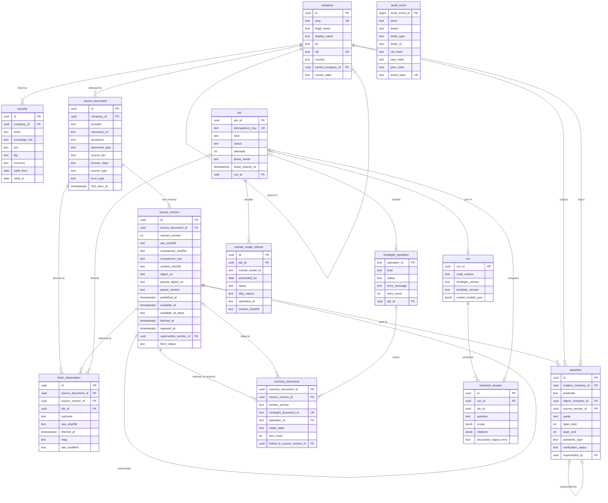

# Data model (Phases 1–2)

The application database schema that the Phase 1 and Phase 2 migrations build, with the invariants the database itself must enforce.

Sources:

- the pilot spec [`.scratch/atlas-pilot/spec.md`](../.scratch/atlas-pilot/spec.md): Part A "Schema (Phase 1 migrations)" and Part B "Schema (Phase 2 migrations)"
- the product spec [`hindsight_investment_research_build_plan.md`](../hindsight_investment_research_build_plan.md) §5.1 (company), §5.3 (source_document / source_version), §5.4 (assertion), §5.8 (job, audit_event), §6.3 (retention mapping) and §9.1 (clocks)
- [ADR-0001](adr/0001-hindsight-document-id-per-source-version.md) (Hindsight document IDs) and [`decisions.md`](decisions.md) (citation states, zero-fact handling, routed-model recording)

Terms follow [`CONTEXT.md`](../CONTEXT.md). The architecture is in [`architecture.md`](architecture.md).

**Status of this document.** It is the contract that tickets 03, 04, 07, 08, 12, 13, 14 and 15 implement. Column names may be refined in those tickets where repository conventions are stronger (build plan §5 allows this). A ticket that changes a name, type or constraint updates this document in the same change. Items marked **(open)** are left to the named ticket.

## 1. Conventions

- **Keys:** UUID primary keys, generated by the application. The column is named `id` (the convention tickets 03, 04 and 07 set); foreign keys are `<table>_id`. Job IDs are deterministic (UUIDv5 of the idempotency key). `audit_event` uses a monotonic `bigint` sequence, because the hash chain needs a total order.
- **Timestamps:** `timestamptz`, stored in UTC. Clock columns are never reused for another meaning (§4 below).
- **Hashes:** lowercase hex SHA-256 as `text` with a `CHECK` on the pattern `^[0-9a-f]{64}$`.
- **Enumerations:** `text` with `CHECK` constraints (easier to extend in a backwards-compatible migration than Postgres enums).
- **JSON:** `jsonb`, only for open-ended metadata and payloads, never for fields the application filters on.
- **Archive locations:** internal application URIs (`archive://<raw|parsed>/sha256/<hex>`, ticket 05), never object-store URLs or credentials.
- **Migrations:** Alembic, backwards-compatible, and tested by upgrading from empty (build plan §12).
- **Every mutation** writes an `audit_event` in the same transaction (§2.6).

Company universe and theme membership are **configuration** (`configs/`), not tables, in Phases 1–2 (spec Part A "Shape"). `company` rows are seeded from `configs/themes/ai-infrastructure.yaml`, keyed by slug, with IDs derived from the CIK. Themes appear only as slugs, in tags (`theme:photonics`) and in scopes.

## 2. Phase 1 tables

### 2.1 `company`

A legal entity, not a ticker (build plan §5.1). Built by ticket 07 (migration `0004`).

| Column | Type | Notes |
|---|---|---|
| `id` | uuid PK | The canonical company ID; also the Hindsight tag `company:<uuid>`. Deterministic: UUIDv5 of the CIK (or of the slug when there is no CIK), so every database seeded from the same config agrees |
| `slug` | text not null, unique | The config key (`lumentum`), used by `atlas ingest --company` |
| `legal_name` | text not null | |
| `display_name` | text not null | |
| `lei` | text null | External mapping; not available for every company |
| `cik` | text null, unique | Zero-padded 10 digits. Lumentum (Phase 1) and Coherent (Phase 2) are seeded from config |
| `country` | text not null | ISO 3166-1 alpha-2 |
| `website` | text null | |
| `parent_company_id` | uuid null FK → company | Parent/subsidiary structure |
| `review_state` | text not null | `unreviewed`, `reviewed` |
| `created_at`, `updated_at` | timestamptz not null | |

Seeding (`atlas companies seed`, and every ingest job for its company) upserts by ID. An unchanged row is left alone and writes no audit event; a changed one writes `company.updated` with the old and new content hashes.

### 2.2 `security`

Effective-dated listing identifiers, so ticker changes, ADRs and multiple listing lines don't change a company's identity.

| Column | Type | Notes |
|---|---|---|
| `id` | uuid PK | UUIDv5 of (company, exchange, ticker, `valid_from`) |
| `company_id` | uuid not null FK → company | |
| `ticker` | text not null | |
| `exchange_mic` | text not null | ISO 10383 |
| `isin`, `figi` | text null | External mappings |
| `instrument_type` | text not null | `common`, `adr`, `preferred`, … |
| `currency` | text not null | ISO 4217 |
| `valid_from` | date not null | |
| `valid_to` | date null | Null means current |

Constraint: no overlapping `[valid_from, valid_to)` for the same (`exchange_mic`, `ticker`), via an exclusion constraint (`btree_gist`). Seeding never deletes a row; an ended listing gets a `valid_to` in config.

### 2.3 `source_document`

The stable identity of a piece of source material, independent of any copy (build plan §5.3; spec story 25). Immutable: a trigger rejects every `UPDATE`, `DELETE` and `TRUNCATE`.

| Column | Type | Notes |
|---|---|---|
| `id` | uuid PK | |
| `company_id` | uuid null FK → company | The company the document is about or was collected for. Many-to-many subjects arrive with entity resolution in Phase 3 |
| `provider` | text not null | Adapter ID, for example `sec_edgar`; also the tag `source:<provider>` |
| `canonical_url` | text not null | Scheme and host lowercased, query and fragment removed; unique together with `provider` |
| `origin_url` | text not null | As first discovered |
| `accession` | text null, indexed | SEC accession number (`0000000000-00-000000`) when the document belongs to a filing. **Not unique:** one filing holds several documents (the primary document and its EX-99 exhibits) |
| `form_type` | text null | SEC form of the filing (`10-K`, `10-Q`, `8-K`, …); also the tag `form:<form>` |
| `document_type` | text null | The document within the filing (`8-K`, `EX-99.1`) |
| `source_type` | text not null | Document kind: `filing`, `xbrl_companyfacts` (later `ir_release`, …); also the tag `doctype:<kind>` |
| `title` | text not null | As first discovered; for display only, never for identity |
| `publisher` | text not null | `SEC EDGAR` for SEC material |
| `source_tier` | text not null | `A`, `B`, `C` (build plan §4.1) |
| `license_class` | text not null | From the entitlement inventory ([`source-licenses.md`](source-licenses.md) §2), checked against the list of classes |
| `first_seen_at` | timestamptz not null | When Atlas first saw it (the adapter's discovery time) |

Identity rule: a Source Document is found by (`provider`, `canonical_url`). For SEC filings the canonical URL is the accession's Archives folder plus the file name, so it is equivalent to (accession, document). Titles are never used, so two quarterly filings with similar titles are never merged.

### 2.4 `source_version`

One immutable, hash-identified copy of a Source Document (build plan §5.3, §4.3; spec stories 26–33).

| Column | Type | Notes |
|---|---|---|
| `id` | uuid PK | Also the stem of the Hindsight document ID (ADR-0001) |
| `source_document_id` | uuid not null FK → source_document | |
| `version_number` | integer not null | 1, 2, … per document; unique per document |
| `raw_sha256` | text not null | Hash of the exact fetched bytes |
| `comparison_sha256` | text not null | Change-detection hash: SHA-256 of the raw bytes after `comparison_rule` removed bytes that are not content |
| `comparison_rule` | text not null | `sec-edge-script-v1` (SEC Archives HTML: every `<script>` element removed) or `identity` (the raw bytes) |
| `object_uri` | text not null | Internal URI of the raw object (`archive://raw/sha256/<hex>`) |
| `byte_size` | bigint not null | Length of the raw bytes |
| `media_type` | text not null | As served, for the raw download |
| `content_sha256` | text null | Hash of the parsed text; null when not parsed |
| `parsed_object_uri` | text null | Internal URI of the parsed object (`archive://parsed/sha256/<hex>`) |
| `parser_version` | text null | Set with the parse (`html-text-v1`) |
| `parse_status` | text not null | `pending`, `parsed`, `incomplete` (undecodable bytes were replaced), `failed`, or `not_applicable` (media types the parser doesn't handle, e.g. companyfacts JSON) (spec story 22) |
| `parse_error` | text null | Set iff `parse_status = failed` |
| `event_at` | timestamptz null | When the underlying development happened, if known (null for SEC filings in Phase 1) |
| `published_at` | timestamptz null | The publisher's release time, when it gives one distinct from availability. Null for SEC: EDGAR's release time is the acceptance time, recorded as `available_at`, and the filing date is in `metadata` |
| `available_at` | timestamptz **not null** | Earliest public availability |
| `available_at_basis` | text **not null** | `sec_acceptance`, `publisher_timestamp`, `observed_discovery`, `observed_revision` (0011) |
| `fetched_at` | timestamptz not null | When these bytes were fetched |
| `ingested_at` | timestamptz not null | When the ledger committed the row (build plan §9.1 strict-replay clock) |
| `supersedes_version_id` | uuid null, unique, FK → source_version | The version this one replaces: the previous version of the same Source Document |
| `fetch_status` | text not null | `ok`, `partial` (bytes truncated or incomplete) |
| `metadata` | jsonb not null default `{}` | Adapter metadata. For SEC: `acceptance_datetime` as received, `accession_number`, `form`, `filing_date`, `report_date`, `primary_document` and `items`. For every fetch: its `url`, the `http` validators and the number of `attempts` |

Invariants enforced in the database:

- `UNIQUE (source_document_id, raw_sha256)`: the same bytes are never two versions of a document.
- `available_at` and `available_at_basis` are `NOT NULL`, and the basis is checked against the enumeration. SEC filing documents use `sec_acceptance`; companyfacts has no acceptance time and uses `observed_discovery`. A version that supersedes an earlier one uses its fetch time, basis `observed_revision` (migration `0011`; `docs/decisions.md`).
- A trigger rejects any `UPDATE` of the content columns (everything except the parse columns) and any `DELETE` or `TRUNCATE`. The parse columns (`content_sha256`, `parsed_object_uri`, `parser_version`, `parse_status`, `parse_error`) may be written again only while `parse_status` is `pending` or `failed`; a recorded parse is never overwritten.
- `supersedes_version_id` is the previous version (`version_number - 1`) of the same Source Document (trigger). It is unique, so the chain never forks, and it is null exactly for version 1.
- The parse columns are consistent: `content_sha256` and `parsed_object_uri` are set iff the status is `parsed` or `incomplete`.

The ledger parses in the same transaction that creates the version, so Phase 1 never leaves a version `pending`. A re-parse under a new parser version must not overwrite the recorded parse. It will be a separate parse record (a `source_parse` table keyed by version and parser version), built when a second parser version exists.

### 2.4a `fetch_observation`

One row per fetch of a Source Document that returned or confirmed content, including fetches that created nothing new (ticket 07). Append-only: a trigger rejects every `UPDATE`, `DELETE` and `TRUNCATE`.

| Column | Type | Notes |
|---|---|---|
| `id` | uuid PK | |
| `source_document_id` | uuid not null FK → source_document | |
| `source_version_id` | uuid not null FK → source_version | The version these bytes are or match; for a 304, the latest version |
| `job_id` | uuid null FK → job | The ingest job that fetched it |
| `outcome` | text not null | `new_version`, `unchanged` (same raw hash or same comparison hash), `not_modified` (HTTP 304) |
| `url` | text not null | The final URL, after redirects |
| `fetched_at` | timestamptz not null | |
| `observed_at` | timestamptz not null | When the ledger recorded it |
| `raw_sha256`, `comparison_sha256` | text null | The hashes of this fetch's bytes; null exactly for a 304 |
| `object_uri` | text null | Set when this fetch's exact bytes differ from the matched version's (only non-content bytes changed), so they stay archived |
| `etag`, `last_modified` | text null | The HTTP validators. The latest observation's are sent on the next fetch (a conditional request) |
| `attempts` | integer not null | HTTP attempts it took |

So an **unchanged re-fetch** (same raw hash, same comparison hash, or HTTP 304) creates no Source Version. It creates an observation, an audit event (`fetch.unchanged` or `fetch.not_modified`) and a job artifact. Fetch errors and permission denials that produce no bytes are recorded as job failures that list each failed URL (spec story 22).

### 2.5 `assertion`

A statement bound to one Source Version and an exact quote span (build plan §5.4; spec stories 37–42).

| Column | Type | Notes |
|---|---|---|
| `id` | uuid PK | The spec's `assertion_id` (primary keys are named `id`) |
| `subject_company_id` | uuid not null FK → company | The spec's `subject_entity_id`. Only companies are entities in Phases 1–2; products, technologies and themes arrive in Phase 3 |
| `predicate` | text not null | Free text in Phase 1; the Relationship predicate whitelist applies to Relationships (Phase 3), not to Assertions |
| `object_company_id` | uuid null FK → company | The spec's `object_entity_id` |
| `value_json` | jsonb null | A value instead of, or as well as, an object |
| `source_version_id` | uuid not null FK → source_version | Must have parsed text (`parse_status` `parsed` or `incomplete`; insert trigger) |
| `quote` | text not null | The spec's `quote_or_span`. Must occur exactly at the span in the archived parse |
| `span_start`, `span_end` | integer not null | Character (Unicode code point) offsets into the parsed text, `[span_start, span_end)`; `quote = parsed_text[span_start:span_end]` is validated on create, and `span_end - span_start = char_length(quote)` is a CHECK |
| `page_or_anchor` | text null | A label for people; `html-text-v1` defines no section anchors, so the offsets are the binding |
| `event_start`, `event_end` | timestamptz null | When the asserted state held |
| `epistemic_type` | text not null | `direct_source_statement`, `company_claim`, `third_party_report`, `agent_inference`, `quantitative_derived` |
| `verification_status` | text not null default `unreviewed` | `unreviewed`, `corroborated`, `disputed`, `rejected`, `superseded`. The API calls this `review_state` |
| `independence_family_id` | uuid null | Evidence Family; null until Phase 3 |
| `extracted_at` | timestamptz not null | |
| `extractor_version` | text not null | `manual` for researcher-created Assertions in Phase 1 |
| `created_by` | text not null | Actor |
| `reviewer_id` | text null | Actor of the latest review; set exactly when reviewed |
| `reviewed_at` | timestamptz null | Set exactly when reviewed |
| `superseded_by` | uuid null FK → assertion | Set exactly when `verification_status = superseded`; never the row itself |

Invariants (migration `0006`, triggers ENABLE ALWAYS):

- Every column except the review columns (`verification_status`, `reviewer_id`, `reviewed_at`, `superseded_by`) is immutable after insert. A correction is a new Assertion plus supersession, never an edit.
- New rows are `unreviewed`.
- Review transitions: `unreviewed`, `corroborated` and `disputed` may move to any other state except `unreviewed`; `rejected` and `superseded` are final.
- A successor must not itself be `rejected` or `superseded`, so supersession never forms a cycle.
- No DELETE or TRUNCATE.
- Each create writes an `assertion.created` audit event, and each review an `assertion.reviewed` event, in the same transaction.

### 2.6 `audit_event`

Append-only and hash-chained (build plan §5.8; spec stories 43–45; ticket 03).

| Column | Type | Notes |
|---|---|---|
| `audit_event_id` | bigint PK (identity) | Total order of the chain |
| `occurred_at` | timestamptz not null | |
| `actor` | text not null | From config (`ATLAS_ACTOR`) in the pilot |
| `action` | text not null | For example `source_version.created`, `fetch.unchanged`, `assertion.created`, `assertion.reviewed`, `bank_template.applied`, `research_answer.requested` |
| `entity_type`, `entity_id` | text not null | What changed |
| `old_hash`, `new_hash` | text null | SHA-256 of the canonical JSON of the entity before and after |
| `payload_json` | jsonb not null default `{}` | Non-secret context (job ID, run ID) |
| `prev_hash` | text null | `event_hash` of the previous event; null only for the first |
| `event_hash` | text not null, unique | SHA-256 over `prev_hash` and the canonical serialization of this row's other columns |

Enforcement in the database, not only in code: a trigger raises on `UPDATE`, `DELETE` and `TRUNCATE`, and the application role has only `INSERT` and `SELECT` on the table. Chain verification recomputes every `event_hash` in order and reports the first tampered or missing event.

### 2.7 `job`

The Postgres job queue (build plan §5.8; spec Part A "Jobs"; ticket 04). `run` and `task` are Phase 4; the columns below leave room for them.

| Column | Type | Notes |
|---|---|---|
| `job_id` | uuid PK | UUIDv5 of `idempotency_key` |
| `idempotency_key` | text not null, unique | Re-enqueuing the same key returns the existing job |
| `kind` | text not null | Phase 1: `ingest`. Phase 2 adds `retain`, `poll_operation`, `reprocess`, `reflect`, `refresh_mental_model` |
| `job_class` | text not null default `interactive` | `interactive` or `backfill`; backfill is claimed only in the nightly window. Migration 0008 (ticket 14); set at enqueue (`--backfill`), inherited by a backfill ingest's retains and their reprocesses |
| `payload_json` | jsonb not null | |
| `status` | text not null | `queued`, `running`, `succeeded`, `failed` (retries exhausted), `cancelled` |
| `attempts` | integer not null default 0 | |
| `max_attempts` | integer not null | Bounded retries |
| `run_after` | timestamptz not null | Per-job backoff; **not implemented**: ticket 14 backs off at the queue level instead (§3.5) |
| `lease_owner` | text null | Worker ID |
| `lease_expires_at` | timestamptz null | An expired lease is reclaimable |
| `failures_json` | jsonb not null default `[]` | One entry per failed attempt: time, classification (`quota`, `unavailable`, `error`, `lease_expired`), message. A `quota`/`unavailable` attempt pauses the queue and isn't counted in `attempts` |
| `artifacts_json` | jsonb not null default `[]` | Produced artifacts, for example Source Version IDs and unchanged-fetch observations |
| `run_id` | uuid null FK → run | Phase 2 |
| `trace_id` | text null | |
| `created_at`, `started_at`, `finished_at` | timestamptz | |

Claiming uses `SELECT … FOR UPDATE SKIP LOCKED` on queued jobs (or expired leases), so two workers never claim the same job. It skips jobs of a kind the queue pause holds back, and backfill jobs outside the window.

## 3. Phase 2 tables

### 3.1 `run` (minimal run record)

Extended into the full run/task model in Phase 4 (spec Part B "Schema").

| Column | Type | Notes |
|---|---|---|
| `run_id` | uuid PK | Also sent as `metadata.run_id` to LiteLLM. Implemented as `id` (migration 0005), like `job.id` |
| `kind` | text not null | `ingest`, `retain`, `reflect`, `mental_model_refresh`, … |
| `code_version` | text not null | Git SHA of the image (`ATLAS_CODE_VERSION`, a build arg), else the package version |
| `hindsight_version` | text not null | For example `0.10.1`, from Hindsight `GET /version` at run start |
| `template_version` | text not null | The bank's latest `bank_template_application.template_version` |
| `routed_models_json` | jsonb not null | Implemented as `routed_models`: `{alias: [{"model": <litellm_params.model>, "model_id": <model_info.id>}, …]}` from LiteLLM `/model/info`, for the configured aliases (`atlas-extract`, `atlas-reflect`) |
| `tokens_in`, `tokens_out` | bigint not null default 0 | Totals |
| `started_at`, `finished_at` | timestamptz | |

### 3.1b `bank_template_application`

One row per application of the bank template (dry run, then import); audited as `bank_template.applied` (entity `hindsight_bank`, old/new hash = the previous/new manifest SHA-256). Migration 0005.

| Column | Type | Notes |
|---|---|---|
| `id` | uuid PK | |
| `bank_id` | text not null | |
| `template_version` | text not null | `template_version` from `configs/hindsight/bank-template.json` |
| `manifest_sha256` | text not null | SHA-256 of the canonical manifest JSON, so an edit without a version bump still shows |
| `dry_run_result`, `import_result` | jsonb not null | Hindsight's import responses |
| `applied_at` | timestamptz not null | |

### 3.2 `hindsight_operation`

One row per asynchronous Hindsight operation Atlas submitted. Migration 0007 (ticket 13); PK named `id`, like the other tables.

| Column | Type | Notes |
|---|---|---|
| `id` | text PK | Hindsight's operation ID |
| `bank_id` | text not null | `atlas-ai-infrastructure` |
| `kind` | text not null | `retain` (a Source Version's batch) or `reprocess` (a zero-fact re-retain). Later: `consolidate`, `mental_model_refresh` |
| `status` | text not null | As Hindsight last reported it (`pending` on submission); the only basis for an outcome |
| `error_message` | text null | Hindsight's error, when it gives one |
| `retry_count` | integer not null default 0 | Hindsight's retry count |
| `source_version_id` | uuid not null FK → source_version | Whose sections the batch holds |
| `document_ids` | jsonb array not null | The Hindsight document IDs in the batch |
| `result_metadata` | jsonb object not null default `{}` | Hindsight's result metadata once terminal (items, `total_tokens`, extraction errors) |
| `job_id` | uuid null FK → job | The job that submitted it |
| `submitted_at`, `last_polled_at`, `completed_at`, `updated_at` | timestamptz | `completed_at` is set once the status is terminal |
| `error_class` | text null | Migration 0008 (ticket 14). A failed operation's class, from its error and its sub-batches' errors: `quota` or `unavailable` pause the queue, and the sections stay `pending` and are resubmitted as a new operation; `permanent` fails them. Null for a completed operation |

### 3.3 `memory_document`

The mapping from the ledger to Memory (build plan §6.3; ADR-0001; spec Part B stories 2–10). Migration 0007 (ticket 13).

| Column | Type | Notes |
|---|---|---|
| `id` | uuid PK | |
| `source_version_id` | uuid not null FK → source_version | |
| `section_anchor` | text not null | `cover`, `part-i-item-1a`, `item-2-02`, `chunk-001`, … (`atlas.retention.sections`) |
| `section_heading` | text null | The Item heading line; null for the cover and chunks |
| `char_start`, `char_end` | integer not null | Character offsets into the parsed text, `[start, end)`; a version's sections tile it |
| `sectioner_version` | text not null | `sec-items-v1` |
| `hindsight_document_id` | text null, unique | `srcv:<source_version_uuid>:<section-anchor>`; null when `linked` |
| `bank_id` | text not null | |
| `operation_id` | text null FK → hindsight_operation | The operation that last retained it (the reprocess, after one) |
| `retain_state` | text not null | `pending`, `completed`, `failed`, `zero_fact`, `linked` |
| `fact_count` | integer null | `memory_unit_count` of the Hindsight document after completion |
| `memory_ids` | jsonb null | The IDs of the memories Hindsight returned for the document (the memory list by `document_id`), recorded after completion; `[]` for zero facts; null before, and for `linked`/`failed` (0011) |
| `reprocess_count` | integer not null default 0 | 0 or 1: a zero-fact section is reprocessed at most once |
| `template_version` | text not null | The bank's applied template version when it was recorded |
| `linked_to_source_version_id` | uuid null FK → source_version | Set when the same raw bytes are already retained |
| `error` | text null | Why a section `failed` (the operation's error, or a document missing after completion) |
| `created_at`, `updated_at` | timestamptz | |

Invariants: `UNIQUE (source_version_id, section_anchor, bank_id)`; `UNIQUE hindsight_document_id`, so an ID is never reused; `linked` exactly when `linked_to_source_version_id` is set and `hindsight_document_id` is null; `completed`/`zero_fact` have a fact count (`zero_fact`: 0); `failed` has an error. A trigger (ENABLE ALWAYS) rejects DELETE and TRUNCATE and any change to a row's identity (Source Version, anchor, offsets, sectioner, document ID, bank, link). A zero-fact section awaiting its reprocess is `pending` with `fact_count` 0. Every insert and state change writes an audit event (`memory_document.*`, `hindsight_operation.*`).

Not implemented: `memory_ids_json`. Hindsight's document read returns counts, not memory IDs; provenance resolves memories through `document_id` and `metadata.source_version_id` (ticket 15).

### 3.4 `research_answer`

A stored reflect answer with its citation states (spec Part B stories 18–25; ticket 15, migration `0009`).

| Column | Type | Notes |
|---|---|---|
| `id` | uuid PK | |
| `bank_id` | text not null | |
| `question` | text not null | |
| `scope` | jsonb not null | `company_ids`, `theme_ids` (theme slugs), and the `tags` and `tags_match` (`any_strict`) sent to Hindsight |
| `response_schema` | jsonb null | The optional JSON Schema object (no union types) |
| `status` | text not null | `pending`, `completed`, `failed` (the API also shows `running` while the job runs) |
| `answer_text` | text null | |
| `structured_output` | jsonb null | As Hindsight returned it |
| `structured_output_error` | text null | Hindsight's error, a missing output, or a schema validation failure; HTTP 200 doesn't imply success |
| `raw_citations` | jsonb null | `based_on.memories` exactly as returned (`id`, `text`, `type`, `context`, `occurred_*`) |
| `citations` | jsonb null | Every cited memory, chunk and quote: kind, state (`resolved`/`unverified`/`broken`), reason, the resolved sources (world fact → Source Version, section, `available_at`) and, for a quote, its matched span |
| `quote_rule` | text null | The quote normalization rule used (`whitespace-and-typographic-quotes-v1`) |
| `run_id` | uuid null FK → run | Null when LiteLLM isn't configured (no run can be recorded) |
| `job_id` | uuid not null, unique | The reflect job's deterministic ID; no FK, because the job is enqueued right after the row commits |
| `error` | text null | Why the job gave up (`failed`) |
| `created_at`, `answered_at` | timestamptz | |

Invariants: `completed` exactly when the text, citations, raw citations, quote rule and answer time are set; `failed` exactly when an error is set; structured output (or its error) only with a schema. A trigger (ENABLE ALWAYS) allows updates only of a `pending` row and never of its question, scope, schema, bank or job, and rejects DELETE and TRUNCATE. Audit actions: `research_answer.requested`, `.answered`, `.failed`.

Not stored: `evidence_missing` and the Evidence list are derived on read from the citations (resolved ones only). The actor is on the audit events. Recall is synchronous and isn't stored. Mental models didn't add a `kind` here: they have their own refresh record (§3.4b), and their citations are resolved on read.

### 3.4b `mental_model_refresh`

One decision of a `refresh_mental_model` job (spec Part B stories 26–29; ticket 16, migration `0010`). The model's content and history live in Hindsight; this is Atlas's record of when and why each refresh ran or didn't, with the content it saw.

| Column | Type | Notes |
|---|---|---|
| `id` | uuid PK | |
| `bank_id`, `mental_model_id` | text not null | The template's model ID (`theme-status`, `bottlenecks`) |
| `job_id` | uuid not null FK → job | A job can record several rows (a quota failure, then the retry after the pause) |
| `scheduled_for` | date null | The day a scheduled refresh is for; null when enqueued by hand |
| `template_version` | text null | The bank's latest applied template version at the time |
| `min_refresh_interval_seconds` | integer not null | From the template's trigger |
| `status` | text not null | `skipped`, `submitted`, `completed`, `failed` |
| `skip_reason` | text null | `min_interval` (refreshed, by Atlas or by Hindsight's cron, inside the interval) or `not_stale` (Hindsight: nothing new in scope) |
| `operation_id`, `operation_status` | text null | The Hindsight refresh operation and its last status |
| `run_id` | uuid null FK → run | The run a submitted refresh recorded (null for a skip, or without LiteLLM); immutable (0011) |
| `error`, `error_class` | text null | `quota`/`unavailable` (the queue paused; retried) or `permanent` |
| `previous_refreshed_at`, `refreshed_at` | timestamptz null | Hindsight's `last_refreshed_at` before, and after (for a skip: as found) |
| `content`, `content_sha256` | text null | The model's content afterwards (for a skip: as found) |
| `raw_citations` | jsonb not null | The content's `based_on` memories as Hindsight returned them |
| `result_metadata` | jsonb not null | The operation's result metadata (outcome, content length, citation counts by type) |
| `requested_at`, `completed_at` | timestamptz | The application clock (the minimum interval is measured on it) |
| `updated_at` | timestamptz | |

Invariants: `skipped` exactly when a skip reason is set and no operation; `failed` exactly when an error is set; `completed` has its completion time and content. A trigger (ENABLE ALWAYS) allows updates only of a `submitted` row, never of its model, bank, job, schedule, interval, operation or request time, and rejects DELETE and TRUNCATE. Audit action: `mental_model.refreshed` (entity `mental_model`, `<bank>:<model>`; old/new hash = the previous and new content SHA-256).

### 3.5 Queue pause state

The queue-level pause (ticket 14, migration 0008). It's resolved as a **single-row `queue_pause` table** plus an append-only `queue_pause_event` history (see `docs/decisions.md`, ticket 14). It's visible through `GET /api/v1/queue` and in metrics.

`queue_pause` (one row, `id = 1`):

| Column | Type | Notes |
|---|---|---|
| `level` | integer not null default 0 | Pauses entered since the last success of a pausable job; 0 = clear. The backoff is 60 s × 2^(level−1), capped at 1 h |
| `error_class` | text null | `quota` or `unavailable`, of the latest pause |
| `reason` | text null | The failure that caused it |
| `kinds` | text[] not null | The job kinds it holds back (the pausable kinds) |
| `backoff_seconds` | double precision null | 0 < b ≤ 3600 |
| `paused_at`, `resume_after` | timestamptz null | Paused now while `level > 0 AND resume_after > now` |
| `episode_started_at` | timestamptz null | The start of this run of pauses; null exactly when `level = 0` |
| `job_id` | uuid null FK → job | The job whose failure caused the latest pause |
| `cleared_at`, `updated_at` | timestamptz | `cleared_at`: when a success last reset the level |

A check requires the pause fields when `level > 0`. The paused flag is derived (`level > 0 AND resume_after > now`), not stored.

`queue_pause_event`: `id`, `level`, `error_class`, `reason`, `kinds`, `backoff_seconds`, `paused_at`, `resume_after`, `job_id`, `job_kind`, one row per pause entered.

## 4. Clocks

| Column | Table | Meaning |
|---|---|---|
| `event_at` | source_version | When the development happened |
| `published_at` | source_version | Publisher's release time |
| `available_at` (+ basis) | source_version | Earliest public availability; the `available_at <= as_of` gate |
| `first_seen_at` | source_document | First seen by Atlas |
| `fetched_at` | source_version | This copy's fetch |
| `ingested_at` | source_version | Committed to the ledger; strict replay also requires `ingested_at <= as_of` |
| `event_start`, `event_end` | assertion | When the asserted state held |
| `extracted_at`, `reviewed_at` | assertion | Processing and review times |

## 5. ER diagram

`audit_event` has no foreign keys by design: it references entities by type and ID, so it can record events about any table without coupling the chain to the schema.

## 6. Deferred (not in Phases 1–2)

- `technology`, `product`, `industry_theme`, `product_company`, `theme_exposure` (build plan §5.2), and `relationship` (§5.5): Phase 3.
- Evidence Families as a table (`independence_family_id` is reserved on `assertion`): Phase 3.
- `hypothesis`, `task`, the full `run`: Phase 4.
- `financial_observation`, `scenario`: Phase 5.
- `research_snapshot`, `evaluation`: Phase 6a (the evaluation fixture format is in [`evaluation-methodology.md`](evaluation-methodology.md)).
